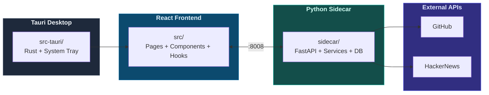

# CLAUDE.md

> Claude Code 在本專案中工作時的指引文件。

---

## AI Assistant Skills

> **IMPORTANT**: Before writing any code, consult `.agent/skills/`:
>
> - **Tauri Master** — `.agent/skills/tauri-master/SKILL.md`
> - **Python Sidecar** — `.agent/skills/python-sidecar/SKILL.md`
> - **React Visualizer** — `.agent/skills/react-visualizer/SKILL.md`

---

## 專案概述

StarScope 是一款桌面應用程式，透過速度分析（而非 star 絕對數量）幫助工程師理解 GitHub 專案的發展動能。使用 Tauri v2（Rust + React + Python sidecar）建構。

---

## 架構



---

## 常用指令

### 前端

```bash
npm run dev              # Vite 開發伺服器（僅前端）
npm run tauri dev        # 完整 Tauri 應用程式
npm run build            # 建構前端
npm run type-check       # TypeScript 型別檢查
npm run lint             # ESLint 檢查
npm run lint:fix         # ESLint 自動修復
npm run format           # Prettier 格式化
npm run build:analyze    # Bundle 大小分析
```

### Python Sidecar

```bash
cd sidecar
python main.py                           # 啟動 FastAPI :8008
pytest tests/ -v                         # 執行所有測試
pytest tests/test_repos.py -v            # 執行單一測試檔
pytest tests/ --cov=. --cov-report=html  # 覆蓋率報告
alembic upgrade head                     # 資料庫遷移
alembic revision -m "description"        # 建立新遷移
```

### 單元測試（Vitest）

```bash
npm run test              # 執行所有單元測試
npm run test:ui           # Vitest UI 模式
npm run test:coverage     # 覆蓋率報告
npm run test:watch        # Watch 模式
```

> **測試覆蓋率**：86%+ 分支覆蓋率（前端 665 + 後端 373 = 1038 個測試案例）

### E2E 測試

```bash
npm run test:e2e          # Playwright 全部測試
npm run test:e2e:chromium # 僅 Chromium
npm run test:e2e:ui       # 互動式 UI 模式
npm run test:e2e:headed   # 顯示瀏覽器視窗
```

### 完整開發流程

```bash
cd sidecar && python main.py    # 終端機 1 — sidecar
npm run tauri dev               # 終端機 2 — Tauri
```

---

## 專案結構

### 前端 `src/`

| 目錄              | 說明                                                 |
|-----------------|----------------------------------------------------|
| `pages/`        | Watchlist、Trends、Discovery、Dashboard、Settings      |
| `components/`   | RepoCard、StarsChart、ContextBadges、GitHubConnection 等 |
| `hooks/`        | 自訂 Hooks（React Query 查詢/Mutation、狀態管理）            |
| `api/client.ts` | 與 sidecar 通訊的 API 客戶端                              |
| `lib/`          | React Query 設定（queryKeys、QueryClient）              |
| `utils/`        | 工具函式（logger、error handling 等）                      |
| `**/__tests__/` | Vitest 單元測試（665 個測試案例）                             |

### Sidecar `sidecar/`

| 目錄             | 說明                                            |
|----------------|-----------------------------------------------|
| `routers/`     | FastAPI 路由（15 個模組：repos、alerts、trends、categories 等） |
| `services/`    | 業務邏輯（14 個服務：analyzer、scheduler、recommender 等）      |
| `db/models.py` | SQLAlchemy 模型（13 張表：Repo、Signal、Category 等）          |
| `tests/`       | pytest 測試，fixtures 在 `conftest.py`            |

### Tauri `src-tauri/`

| 檔案                | 說明                  |
|-------------------|---------------------|
| `src/main.rs`     | Rust 進入點、系統匣、IPC 命令 |
| `tauri.conf.json` | Tauri 設定、CSP、視窗設定   |

---

## 關鍵服務

| 服務                    | 說明                            |
|-----------------------|-------------------------------|
| `github.py`           | GitHub API 客戶端（Rate Limit 感知） |
| `github_auth.py`      | OAuth Device Flow 驗證          |
| `analyzer.py`         | Star 速度與信號計算                  |
| `scheduler.py`        | APScheduler 背景排程（含失敗追蹤機制）     |
| `anomaly_detector.py` | 異常偵測（批次預載 active signals）     |
| `backup.py`           | SQLite 資料庫備份與還原               |
| `context_fetcher.py`  | HackerNews 上下文資訊彙整            |
| `hacker_news.py`      | Hacker News Algolia API 客戶端   |
| `recommender.py`      | 相似 repo 推薦（topics + language） |
| `snapshot.py`         | Repo 快照更新（metadata + signals） |
| `alerts.py`           | 警報規則評估與觸發                     |
| `queries.py`          | 共用 DB 查詢工具                    |
| `settings.py`         | 應用設定管理（Keyring 整合）            |
| `rate_limiter.py`     | API 請求限速與指數退避重試               |

---

## 環境設定

複製 `sidecar/.env.example` 至 `sidecar/.env`：

```bash
GITHUB_CLIENT_ID=...    # OAuth Device Flow（建議）
# 或
GITHUB_TOKEN=ghp_...    # Personal Access Token（舊版）
ENV=development
DEBUG=false
PORT=8008
```

---

## 測試策略

| 類型     | 工具             | 位置                           |
|--------|----------------|------------------------------|
| 單元測試   | Vitest         | `src/**/__tests__/`          |
| 後端測試   | pytest（非同步）    | `sidecar/tests/`             |
| E2E 測試 | Playwright     | `e2e/`                       |
| CI     | GitHub Actions | `.github/workflows/test.yml` |

### 注意事項

- 重構 hooks 時需同步更新測試 mocks（例：`useWatchlist` → `useWatchlistState` + `useWatchlistActions`）
- 測試單一檔案 - `npm run test -- path/to/file.test.tsx`
- Context Provider 包裹順序 - `WatchlistProvider` 在 `I18nContext` 和 `ThemeContext` 內部

---

## API 端點

所有端點使用統一 `ApiResponse[T]` 格式回傳 `{success, data, message, error}`。
前端 `client.ts` 的 `doFetch` 自動 unwrap `data` 欄位。

| 路由模組                | 前綴                       | 主要端點                              |
|---------------------|--------------------------|-----------------------------------|
| `repos`             | `/api`                   | repos CRUD、手動 fetch、batch fetch-all |
| `alerts`            | `/api/alerts`            | 規則 CRUD、triggered 列表、acknowledge  |
| `trends`            | `/api/trends`            | velocity / delta-7d / acceleration 排行 |
| `categories`        | `/api/categories`        | 分類 CRUD、tree 結構、repo 歸類管理        |
| `early_signals`     | `/api/early-signals`     | 信號列表、summary、acknowledge、batch   |
| `context`           | `/api/context`           | HN signals / badges、batch badges  |
| `charts`            | `/api/charts`            | Star 歷史圖表資料（7d/30d/90d）          |
| `recommendations`   | `/api/recommendations`   | 相似 repo、相似度計算、recalculate       |
| `discovery`         | `/api/discovery`         | GitHub 搜尋（rate limited 30/min）   |
| `commit_activity`   | `/api/commit-activity`   | Commit 活動資料與摘要                   |
| `languages`         | `/api/languages`         | 程式語言分佈與摘要                        |
| `star_history`      | `/api/star-history`      | Star 歷史回填（< 5000 stars）          |
| `export`            | `/api/export`            | Watchlist JSON/CSV 匯出            |
| `github_auth`       | `/api/github-auth`       | OAuth Device Flow、連線狀態           |
| `health`            | `/api`                   | 健康檢查                              |

> 共 15 個路由模組、64 個端點

---

## 資料庫

SQLite 位於 `sidecar/starscope.db`（13 張表）：

| 資料表                | 說明                              |
|--------------------|---------------------------------|
| `repos`            | 追蹤中的 GitHub 儲存庫                 |
| `repo_snapshots`   | 時間點快照（stars、forks、watchers 等）   |
| `signals`          | 計算的速度信號（velocity、acceleration 等）|
| `alert_rules`      | 使用者定義的警報規則                      |
| `triggered_alerts` | 已觸發的警報記錄                        |
| `context_signals`  | 外部情境信號（HN 提及）                   |
| `similar_repos`    | 相似 repo 關係與分數                   |
| `categories`       | 使用者自訂分類（支援階層 parent_id）         |
| `repo_categories`  | Repo ↔ Category 多對多關聯          |
| `early_signals`    | 異常偵測信號（rising star、spike 等）     |
| `app_settings`     | 應用設定（key-value，含 Keyring 整合）    |
| `commit_activities`| 每週 commit 活動資料                  |
| `repo_languages`   | 程式語言分佈（bytes + 百分比）             |

---

## 前端架構模式

### React Query 資料層

- **QueryClient 設定** (`lib/react-query.ts`) — staleTime 5min、gcTime 30min、retry 1
- **queryKeys 工廠** — 型別安全的 query key 生成器，避免魔術字串
- **Query hooks**:
  - `useReposQuery` — repos 列表查詢（WatchlistContext 內部使用）
  - `useTrends` — Trends 頁面主資料（含 filter 狀態）
  - `useDashboard` — 4 個平行 useQuery（repos、alerts、signals、summary）
- **寫入操作** — 由 `WatchlistContext` actions 統一處理（addRepo / removeRepo / fetchRepo / refreshAll），成功後自動 invalidate React Query cache
- **測試工具** — `createTestQueryClient()` 提供零快取零重試的測試用 QueryClient

### Watchlist Context + useReducer 架構

- `WatchlistContext.tsx` — 資料層由 React Query 管理，Context 只負責 UI 狀態
- 資料來源 — `useReposQuery()` + `useQuery(health)` → 合併進 state context
- State Machine Pattern — `LoadingState` 使用 Discriminated Unions 消除不可能狀態
- Context 分層（優化 re-render）:
  - `WatchlistStateContext` — 只讀狀態（repos 來自 React Query、UI 來自 reducer）
  - `WatchlistActionsContext` — 業務邏輯（mutation + cache invalidation）
- Selector hooks（精準訂閱）:
  - `useFilteredRepos()` — 套用分類 + 搜尋篩選
  - `useLoadingRepo()` — 當前載入的 repo ID
  - `useIsRefreshing()` — 是否正在刷新
  - `useIsRecalculating()` — 是否正在重算相似度
- 測試策略 — Mock Context hooks：`useWatchlistState`, `useWatchlistActions`

### React-Window (虛擬滾動)

- **版本** - `react-window@2.2.5`（v2 API）
- **核心組件** - `List` 需 4 個必要 props：`rowComponent`, `rowCount`, `rowHeight`, `style`（含 height/width）
- **RowComponent 型別** - `RowComponentProps` from `react-window`
- **動態行高** - `rowHeight` 支援函數型式 `(index: number) => number`，用於圖表展開時調整行高
  - 收合：`COLLAPSED_ITEM_SIZE = 296px`（卡片 280 + 間距 16）
  - 展開：`EXPANDED_ITEM_SIZE = 596px`（加上圖表 300px）
- **圖表展開狀態** - 由 `RepoList` 層級的 `expandedCharts: Set<number>` 管理，通過 `chartExpanded` / `onChartToggle` props 傳入 `RepoCard`
- **Memo 優化** - `onChartToggle` 接受 `(repoId: number)` 參數以避免 inline arrow 破壞 `RepoCard` 的 `memo`
- **常見陷阱** - v2 API 使用 `rowComponent` prop（非 v1 的 `children` render prop）；避免直接傳 `itemData` 到 `List`，改用 `rowProps`；避免在 `RowComponent` 中使用 inline arrow 作為 memoized 子元件的 callback
