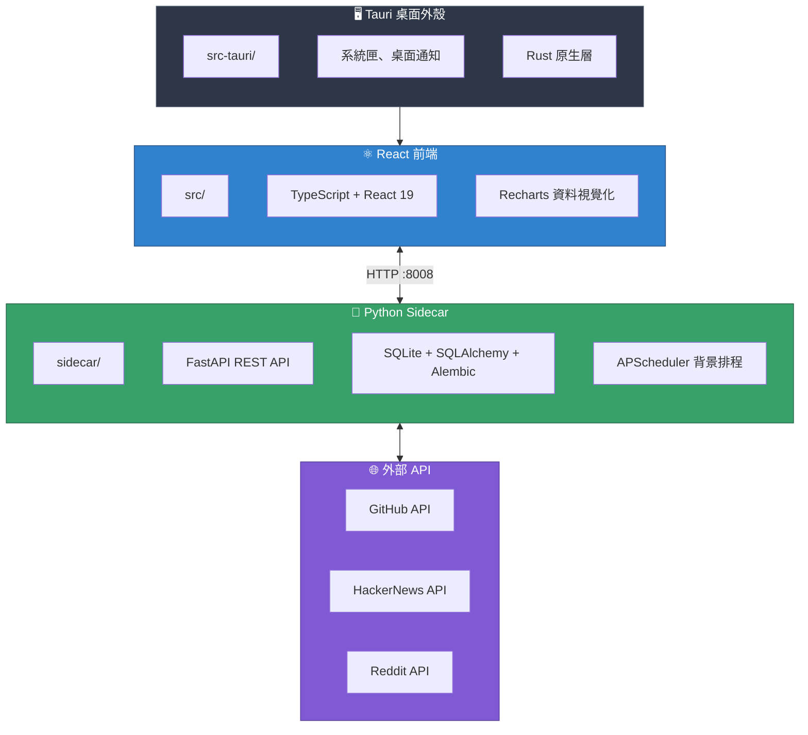

# CLAUDE.md

此檔案為 Claude Code (claude.ai/code) 在本專案中工作時提供指引。

## 🤖 AI Assistant Skills
> **IMPORTANT**: This project utilizes specialized AI skills.
> Before writing any code, you MUST consult the guidelines in `.agent/skills/`.
>
> - **Tauri Master**: Read `.agent/skills/tauri-master/SKILL.md`
> - **Python Sidecar**: Read `.agent/skills/python-sidecar/SKILL.md`
> - **React Visualizer**: Read `.agent/skills/react-visualizer/SKILL.md`

## 專案概述

StarScope 是一款桌面應用程式，透過速度分析（而非單純的 star 絕對數量）幫助工程師理解 GitHub 專案的發展動能。使用 Tauri v2（Rust + React + Python sidecar）建構。

## 架構



## 常用指令

### 前端開發
```bash
npm run dev              # 啟動 Vite 開發伺服器（僅前端）
npm run tauri dev        # 啟動完整 Tauri 應用程式（前端 + Rust）
npm run build            # 建構前端
npm run type-check       # TypeScript 型別檢查
npm run lint             # ESLint 檢查
npm run lint:fix         # ESLint 自動修復
npm run format           # Prettier 格式化
```

### Python Sidecar
```bash
cd sidecar
python main.py                           # 啟動 FastAPI 伺服器於 :8008
pytest tests/ -v                         # 執行所有測試
pytest tests/test_repos.py -v            # 執行單一測試檔案
pytest tests/ --cov=. --cov-report=html  # 執行測試並產生覆蓋率報告
alembic upgrade head                     # 執行資料庫遷移
alembic revision -m "description"        # 建立新的遷移
```

### E2E 測試
```bash
npm run test:e2e              # 執行所有 Playwright 測試
npm run test:e2e:chromium     # 僅在 Chromium 執行
npm run test:e2e:ui           # 互動式 UI 模式
npm run test:e2e:headed       # 顯示瀏覽器視窗執行
```

### 完整開發流程
```bash
# 終端機 1：啟動 Python sidecar
cd sidecar && python main.py

# 終端機 2：啟動 Tauri 開發模式
npm run tauri dev
```

## 專案結構

### 前端 (src/)
- `pages/` - 主要頁面：Watchlist、Trends、Signals、Compare、Settings
- `components/` - 可重用元件：RepoCard、StarsChart、HealthBadge、GitHubConnection
- `api/client.ts` - 與 sidecar 通訊的 API 客戶端函式

### Sidecar (sidecar/)
- `routers/` - FastAPI 端點（repos、alerts、webhooks、github_auth 等）
- `services/` - 業務邏輯（analyzer、health_scorer、github、scheduler 等）
- `db/models.py` - SQLAlchemy 模型（Repo、Snapshot、Alert、Webhook、AppSetting）
- `tests/` - pytest 測試，fixtures 在 conftest.py

### Tauri (src-tauri/)
- `src/main.rs` - Rust 進入點、系統匣、IPC 命令
- `tauri.conf.json` - Tauri 設定、CSP、視窗設定

## 關鍵服務

| 服務                   | 說明                        |
|----------------------|---------------------------|
| `github.py`          | GitHub API 客戶端（具速率限制感知）   |
| `github_auth.py`     | OAuth Device Flow 驗證      |
| `analyzer.py`        | Star 速度與信號計算              |
| `health_scorer.py`   | 7 維度專案健康度評分               |
| `scheduler.py`       | APScheduler 背景排程管理        |
| `context_fetcher.py` | HackerNews/Reddit 上下文資訊彙整 |

## 環境設定

複製 `sidecar/.env.example` 至 `sidecar/.env`：
```bash
GITHUB_CLIENT_ID=...    # OAuth Device Flow（建議使用）
# 或
GITHUB_TOKEN=ghp_...    # Personal Access Token（舊版方式）
ENV=development
DEBUG=false
PORT=8008
```

## 測試

- **後端**：pytest 支援非同步，fixtures 在 `conftest.py`
- **E2E**：Playwright 測試在 `e2e/` 目錄
- **CI**：GitHub Actions 在 PR 時執行測試（`.github/workflows/test.yml`）

## API 端點 (sidecar)

| 端點                                  | 說明                   |
|-------------------------------------|----------------------|
| `GET /api/repos`                    | 列出追蹤中的儲存庫            |
| `POST /api/repos`                   | 新增儲存庫至追蹤清單           |
| `GET /api/trends`                   | 取得趨勢儲存庫              |
| `GET /api/early-signals`            | 取得早期信號偵測             |
| `POST /api/github-auth/device-code` | 啟動 OAuth Device Flow |
| `GET /api/github-auth/status`       | 檢查 GitHub 連線狀態       |

## 資料庫

SQLite 資料庫位於 `sidecar/starscope.db`。主要資料表：
- `repos` - 追蹤中的儲存庫
- `snapshots` - 歷史 star 數記錄
- `signals` - 偵測到的速度信號
- `alerts` - 使用者定義的警報規則
- `webhooks` - Webhook 設定
- `app_settings` - OAuth token 及設定
