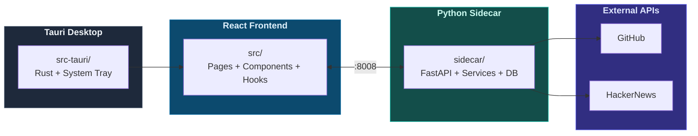

# CLAUDE.md

> Claude Code 在本專案中工作時的指引文件。

---

## AI Assistant Skills

> **IMPORTANT**: Before writing any code, consult `.agent/skills/`:
>
> - **Tauri Master** — `.agent/skills/tauri-master/SKILL.md`
> - **Python Sidecar** — `.agent/skills/python-sidecar/SKILL.md`
> - **React Visualizer** — `.agent/skills/react-visualizer/SKILL.md`

---

## 專案概述

StarScope 是一款桌面應用程式，透過速度分析（而非 star 絕對數量）幫助工程師理解 GitHub 專案的發展動能。使用 Tauri v2（Rust + React + Python sidecar）建構。

---

## 架構



---

## 常用指令

### 前端

```bash
npm run dev              # Vite 開發伺服器（僅前端）
npm run tauri dev        # 完整 Tauri 應用程式
npm run build            # 建構前端
npm run type-check       # TypeScript 型別檢查
npm run lint             # ESLint 檢查
npm run lint:fix         # ESLint 自動修復
npm run format           # Prettier 格式化
```

### Python Sidecar

```bash
cd sidecar
python main.py                           # 啟動 FastAPI :8008
pytest tests/ -v                         # 執行所有測試
pytest tests/test_repos.py -v            # 執行單一測試檔
pytest tests/ --cov=. --cov-report=html  # 覆蓋率報告
alembic upgrade head                     # 資料庫遷移
alembic revision -m "description"        # 建立新遷移
```

### 單元測試（Vitest）

```bash
npm run test              # 執行所有單元測試
npm run test:ui           # Vitest UI 模式
npm run test:coverage     # 覆蓋率報告
npm run test:watch        # Watch 模式
```

> **測試覆蓋率**：86%+ 分支覆蓋率（672 個測試案例）

### E2E 測試

```bash
npm run test:e2e          # Playwright 全部測試
npm run test:e2e:chromium # 僅 Chromium
npm run test:e2e:ui       # 互動式 UI 模式
npm run test:e2e:headed   # 顯示瀏覽器視窗
```

### 完整開發流程

```bash
cd sidecar && python main.py    # 終端機 1 — sidecar
npm run tauri dev               # 終端機 2 — Tauri
```

---

## 專案結構

### 前端 `src/`

| 目錄              | 說明                                                 |
|-----------------|----------------------------------------------------|
| `pages/`        | Watchlist、Trends、Discovery、Dashboard、Settings      |
| `components/`   | RepoCard、StarsChart、HealthBadge、GitHubConnection 等 |
| `hooks/`        | 自訂 Hooks（API 呼叫、狀態管理、副作用）                          |
| `api/client.ts` | 與 sidecar 通訊的 API 客戶端                              |
| `utils/`        | 工具函式（logger、error handling 等）                      |
| `**/__tests__/` | Vitest 單元測試（672 個測試案例）                             |

### Sidecar `sidecar/`

| 目錄             | 說明                                            |
|----------------|-----------------------------------------------|
| `routers/`     | FastAPI 路由（repos、alerts、webhooks、github_auth） |
| `services/`    | 業務邏輯（analyzer、health_scorer、scheduler 等）      |
| `db/models.py` | SQLAlchemy 模型（Repo、Snapshot、Alert 等）          |
| `tests/`       | pytest 測試，fixtures 在 `conftest.py`            |

### Tauri `src-tauri/`

| 檔案                | 說明                  |
|-------------------|---------------------|
| `src/main.rs`     | Rust 進入點、系統匣、IPC 命令 |
| `tauri.conf.json` | Tauri 設定、CSP、視窗設定   |

---

## 關鍵服務

| 服務                   | 說明                            |
|----------------------|-------------------------------|
| `github.py`          | GitHub API 客戶端（Rate Limit 感知） |
| `github_auth.py`     | OAuth Device Flow 驗證          |
| `analyzer.py`        | Star 速度與信號計算                  |
| `health_scorer.py`   | 7 維度專案健康度評分                   |
| `scheduler.py`       | APScheduler 背景排程              |
| `context_fetcher.py` | HackerNews 上下文資訊彙整            |

---

## 環境設定

複製 `sidecar/.env.example` 至 `sidecar/.env`：

```bash
GITHUB_CLIENT_ID=...    # OAuth Device Flow（建議）
# 或
GITHUB_TOKEN=ghp_...    # Personal Access Token（舊版）
ENV=development
DEBUG=false
PORT=8008
```

---

## 測試策略

| 類型     | 工具             | 位置                           |
|--------|----------------|------------------------------|
| 單元測試   | Vitest         | `src/**/__tests__/`          |
| 後端測試   | pytest（非同步）    | `sidecar/tests/`             |
| E2E 測試 | Playwright     | `e2e/`                       |
| CI     | GitHub Actions | `.github/workflows/test.yml` |

---

## API 端點

| 端點                                  | 說明                   |
|-------------------------------------|----------------------|
| `GET /api/repos`                    | 列出追蹤中的儲存庫            |
| `POST /api/repos`                   | 新增儲存庫                |
| `GET /api/trends`                   | 趨勢儲存庫                |
| `GET /api/early-signals`            | 早期信號偵測               |
| `POST /api/github-auth/device-code` | 啟動 OAuth Device Flow |
| `GET /api/github-auth/status`       | GitHub 連線狀態          |

---

## 資料庫

SQLite 位於 `sidecar/starscope.db`：

| 資料表            | 說明              |
|----------------|-----------------|
| `repos`        | 追蹤中的儲存庫         |
| `snapshots`    | 歷史 star 數記錄     |
| `signals`      | 偵測到的速度信號        |
| `alerts`       | 使用者定義的警報規則      |
| `webhooks`     | Webhook 設定      |
| `app_settings` | OAuth token 及設定 |
