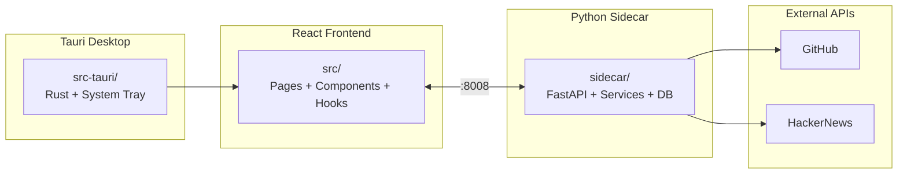

# CLAUDE.md

> Claude Code 在本專案中工作時的指引文件。專題知識按需載入自 `.claude/rules/`。

---

## 專案概述

StarScope 是一款桌面應用程式，透過速度分析（而非 star 絕對數量）幫助工程師理解 GitHub 專案的發展動能。使用 Tauri v2（Rust + React + Python sidecar）建構。


```mermaid
graph LR
    subgraph Desktop["Tauri Desktop"]
        T["src-tauri/\nRust + System Tray"]
    end

    subgraph Frontend["React Frontend"]
        F["src/\nPages + Components + Hooks"]
    end

    subgraph Backend["Python Sidecar"]
        B["sidecar/\nFastAPI + Services + DB"]
    end

    subgraph APIs["External APIs"]
        G["GitHub"]
        H["HackerNews"]
    end

    T --> F
    F <-->|":8008"| B
    B --> G
    B --> H
```

---

## 常用指令

### 前端

```bash
npm run dev              # Vite 開發伺服器（僅前端）
npm run tauri dev        # 完整 Tauri 應用程式
npm run build            # 建構前端
npm run type-check       # TypeScript 型別檢查
npm run lint             # ESLint 檢查
npm run lint:fix         # ESLint 自動修復
npm run format           # Prettier 格式化
npm run build:analyze    # Bundle 大小分析
```

### Python Sidecar

```bash
cd sidecar
python main.py                           # 啟動 FastAPI :8008
pytest tests/ -v                         # 執行所有測試
pytest tests/test_repos.py -v            # 執行單一測試檔
pytest tests/ --cov=. --cov-report=html  # 覆蓋率報告
alembic upgrade head                     # 資料庫遷移
alembic revision -m "description"        # 建立新遷移
```

### 單元測試（Vitest）

```bash
npm run test              # 執行所有單元測試
npm run test:ui           # Vitest UI 模式
npm run test:coverage     # 覆蓋率報告
npm run test:watch        # Watch 模式
```

### E2E 測試

```bash
npm run test:e2e          # Playwright 全部測試
npm run test:e2e:chromium # 僅 Chromium
npm run test:e2e:ui       # 互動式 UI 模式
npm run test:e2e:headed   # 顯示瀏覽器視窗
```

### 完整開發流程

```bash
cd sidecar && python main.py    # 終端機 1 — sidecar
npm run tauri dev               # 終端機 2 — Tauri
```

---

## 專案結構

### 前端 `src/`

| 目錄              | 說明                                                    |
|-----------------|-------------------------------------------------------|
| `pages/`        | Watchlist、Trends、Discovery、Dashboard、Compare、Settings |
| `components/`   | RepoCard、StarsChart、ContextBadges、GitHubConnection 等  |
| `hooks/`        | 自訂 Hooks（React Query、狀態管理、通知、匯入等）                     |
| `api/client.ts` | 與 sidecar 通訊的 API 客戶端                                 |
| `lib/`          | React Query 設定（queryKeys、QueryClient）                 |
| `utils/`        | 工具函式（logger、error handling 等）                         |
| `**/__tests__/` | Vitest 單元測試                                           |

### Sidecar `sidecar/`

| 目錄             | 說明                                              |
|----------------|-------------------------------------------------|
| `routers/`     | FastAPI 路由（16 個端點模組 + `dependencies.py` 共用依賴注入） |
| `services/`    | 業務邏輯（15 個服務）                                    |
| `db/models.py` | SQLAlchemy 模型（11 張表）                            |
| `tests/`       | pytest 測試，fixtures 在 `conftest.py`              |

### Tauri `src-tauri/`

| 檔案                | 說明                  |
|-------------------|---------------------|
| `src/main.rs`     | Rust 進入點（呼叫 lib.rs） |
| `src/lib.rs`      | Sidecar 管理、系統匣、視窗控制 |
| `tauri.conf.json` | Tauri 設定、CSP、視窗設定   |

---

## 關鍵前端 Hooks

| Hook                     | 說明                                            |
|--------------------------|-----------------------------------------------|
| `useOSNotification`      | OS 層級通知（Tauri notification plugin）— 權限管理、發送通知 |
| `useNotifications`       | 通知中心整合 — 儲存、輪詢、操作、OS 通知整合                     |
| `useNotificationPolling` | 通知輪詢 — 定時取得已觸發警報，偵測新通知並發送 OS 推播               |
| `useImport`              | 批次匯入 — CSV/JSON/TXT 檔案解析、文字貼上                 |
| `useImportExecutor`      | 匯入執行器 — 循序調用 addRepo API、進度追蹤                 |
| `useAlertRules`          | 警報規則管理 — CRUD 操作、手動檢查、表單狀態                    |

---

## 環境設定

複製 `sidecar/.env.example` 至 `sidecar/.env`：

```bash
GITHUB_CLIENT_ID=...    # OAuth Device Flow（建議）
# 或
GITHUB_TOKEN=ghp_...    # Personal Access Token（舊版）
ENV=development
DEBUG=false
PORT=8008
```

---

## 測試策略

| 類型     | 工具             | 位置                           |
|--------|----------------|------------------------------|
| 單元測試   | Vitest         | `src/**/__tests__/`          |
| 後端測試   | pytest（非同步）    | `sidecar/tests/`             |
| E2E 測試 | Playwright     | `e2e/`                       |
| CI     | GitHub Actions | `.github/workflows/test.yml` |

### 注意事項

- 重構 hooks 時需同步更新測試 mocks（例：`useWatchlist` → `useWatchlistState` + `useWatchlistActions`）
- 測試單一檔案 - `npm run test -- path/to/file.test.tsx`
- Context Provider 包裹順序 - `WatchlistProvider` 在 `I18nContext` 和 `ThemeContext` 內部

---

## 安全性決策記錄

### CSP `style-src 'unsafe-inline'`

`tauri.conf.json` 中的 CSP 使用 `style-src 'self' 'unsafe-inline'`。此決策的原因：

- **必要性**：Recharts 在 runtime 注入 inline styles，無法避免
- **風險評估**：`unsafe-inline` 僅適用於 `style-src`，`script-src` 並未包含 `unsafe-inline`（這是更關鍵的安全邊界）
- **Desktop 應用環境**：Tauri 應用不暴露於公共網路，XSS 攻擊面遠小於 Web 應用
- **結論**：可接受的 tradeoff。若未來 Recharts 支援 nonce-based CSP，應升級

### API 不使用版本化路徑

桌面應用的前端與後端一起打包發佈（同一個 Tauri binary），版本始終一致，因此 API 不需要 `/api/v1/` 版本前綴。

---

## 按需載入的規則（`.claude/rules/`）

| 規則檔                    | 內容                                                     | 載入條件（`paths:` frontmatter）                                     |
|------------------------|--------------------------------------------------------|----------------------------------------------------------------|
| `api-endpoints.md`     | 16 個 API 路由模組表、統一回應格式                                  | `sidecar/routers/**`、`src/api/**`                              |
| `database.md`          | 11 張 SQLite 表說明、Alembic 遷移                             | `sidecar/db/**`、`sidecar/alembic/**`、`sidecar/alembic*`        |
| `frontend-patterns.md` | React Query 資料層、Watchlist Context 架構、react-window 虛擬滾動 | `src/hooks/**`、`src/components/**`、`src/pages/**`、`src/lib/**` |
| `sidecar-services.md`  | 15 個 sidecar 服務模組表                                     | `sidecar/services/**`                                          |
