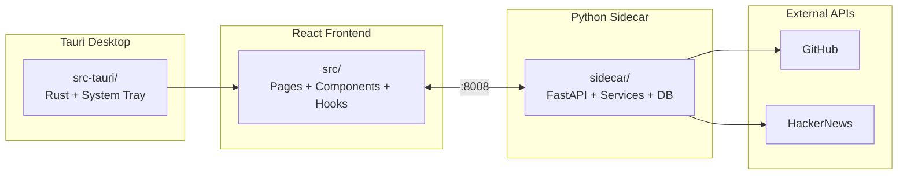

# CLAUDE.md

> Claude Code 在本專案中工作時的指引文件。
>
> **撰寫原則**：只記錄「從 code 看不出來的事」——路徑陷阱、跨層約定、函式庫的反直覺行為、設計取捨的理由。可以用一行指令查到的東西（有哪些服務、有哪些表、有幾個路由）**不寫進文件**，因為 `ls` 的答案永遠正確，而文件會過時。

---

## 專案概述

StarScope 是一款桌面應用程式，透過速度分析（而非 star 絕對數量）幫助工程師理解 GitHub 專案的發展動能。使用 Tauri v2（Rust + React + Python sidecar）建構。

應用分兩層：**發現層**（Discovery 頁的 For You feed——依使用者興趣清單每日產生個人化推薦）與**監測層**（Watchlist、Trends、Compare、警報——對已追蹤 repo 做時序快照與訊號分析）。監測層的所有功能都依賴發現層或使用者手動把 repo 加入 watchlist，watchlist 為空時整個監測層不會有資料。


```mermaid
graph LR
    subgraph Desktop["Tauri Desktop"]
        T["src-tauri/\nRust + System Tray"]
    end

    subgraph Frontend["React Frontend"]
        F["src/\nPages + Components + Hooks"]
    end

    subgraph Backend["Python Sidecar"]
        B["sidecar/\nFastAPI + Services + DB"]
    end

    subgraph APIs["External APIs"]
        G["GitHub"]
        H["HackerNews"]
    end

    T --> F
    F <-->|":8008"| B
    B --> G
    B --> H
```

---

## 常用指令

### 前端

```bash
npm run dev              # Vite 開發伺服器（僅前端）
npm run tauri dev        # 完整 Tauri 應用程式
npm run build            # 建構前端
npm run type-check       # TypeScript 型別檢查
npm run lint             # ESLint 檢查
npm run lint:fix         # ESLint 自動修復
npm run format           # Prettier 格式化
npm run build:analyze    # Bundle 大小分析
```

### Python Sidecar

```bash
cd sidecar
python main.py                           # 啟動 FastAPI :8008
pytest tests/ -v                         # 執行所有測試
pytest tests/test_repos.py -v            # 執行單一測試檔
pytest tests/ --cov=. --cov-report=html  # 覆蓋率報告
alembic upgrade head                     # 資料庫遷移
alembic revision -m "description"        # 建立新遷移
```

### 單元測試（Vitest）

```bash
npm run test              # 執行所有單元測試
npm run test:ui           # Vitest UI 模式
npm run test:coverage     # 覆蓋率報告
npm run test:watch        # Watch 模式
```

### E2E 測試

```bash
npm run test:e2e          # Playwright 全部測試
npm run test:e2e:chromium # 僅 Chromium
npm run test:e2e:ui       # 互動式 UI 模式
npm run test:e2e:headed   # 顯示瀏覽器視窗
```

### 完整開發流程

```bash
cd sidecar && python main.py    # 終端機 1 — sidecar
npm run tauri dev               # 終端機 2 — Tauri
```

---

## 專案結構

### 前端 `src/`

| 目錄              | 說明                                                    |
|-----------------|-------------------------------------------------------|
| `pages/`        | Watchlist、Trends、Discovery、Dashboard、Compare、Settings |
| `components/`   | RepoCard、StarsChart、ContextBadges、GitHubConnection 等  |
| `hooks/`        | 自訂 Hooks（React Query、狀態管理、通知、匯入等）                     |
| `api/client.ts` | 與 sidecar 通訊的 API 客戶端                                 |
| `lib/`          | React Query 設定（queryKeys、QueryClient）                 |
| `utils/`        | 工具函式（logger、error handling 等）                         |
| `**/__tests__/` | Vitest 單元測試                                           |

### Sidecar `sidecar/`

| 目錄             | 說明                                              |
|----------------|-------------------------------------------------|
| `routers/`     | FastAPI 路由。⚠️ `dependencies.py` 不是端點模組，是 `Depends()` 共用注入 helper |
| `services/`    | 業務邏輯                                            |
| `db/models.py` | SQLAlchemy 模型                                    |
| `tests/`       | pytest 測試，fixtures 在 `conftest.py`              |

### Tauri `src-tauri/`

| 檔案                | 說明                  |
|-------------------|---------------------|
| `src/main.rs`     | Rust 進入點（呼叫 lib.rs） |
| `src/lib.rs`      | Sidecar 管理、系統匣、視窗控制 |
| `tauri.conf.json` | Tauri 設定、CSP、視窗設定   |

---

## 關鍵前端 Hooks

| Hook                     | 說明                                            |
|--------------------------|-----------------------------------------------|
| `useOSNotification`      | OS 層級通知（Tauri notification plugin）— 權限管理、發送通知 |
| `useNotifications`       | 通知中心整合 — 儲存、輪詢、操作、OS 通知整合                     |
| `useNotificationPolling` | 通知輪詢 — 定時取得已觸發警報，偵測新通知並發送 OS 推播               |
| `useImport`              | 批次匯入 — CSV/JSON/TXT 檔案解析、文字貼上                 |
| `useImportExecutor`      | 匯入執行器 — 循序調用 addRepo API、進度追蹤                 |
| `useAlertRules`          | 警報規則管理 — CRUD 操作、手動檢查、表單狀態                    |
| `useFeed`                | For You feed — 當日推薦、空清單自動產生一次、⭐/🚫 回饋           |
| `useInterests`           | 興趣清單與黑名單 CRUD（驅動 feed 的排序來源）                   |

---

## 環境設定

複製 `sidecar/.env.example` 至 `sidecar/.env`：

```bash
GITHUB_CLIENT_ID=...    # OAuth Device Flow（建議）
# 或
GITHUB_TOKEN=ghp_...    # Personal Access Token（舊版）
ENV=development
DEBUG=false
PORT=8008
```

---

## 測試策略

| 類型     | 工具             | 位置                           |
|--------|----------------|------------------------------|
| 單元測試   | Vitest         | `src/**/__tests__/`          |
| 後端測試   | pytest（非同步）    | `sidecar/tests/`             |
| E2E 測試 | Playwright     | `e2e/`                       |
| CI     | GitHub Actions | `.github/workflows/test.yml` |

### 注意事項

- 重構 hooks 時需同步更新測試 mocks（例：`useWatchlist` → `useWatchlistState` + `useWatchlistActions`）
- 測試單一檔案 - `npm run test -- path/to/file.test.tsx`
- Context Provider 包裹順序 - `WatchlistProvider` 在 `I18nContext` 和 `ThemeContext` 內部

---

## 安全性決策記錄

### CSP `style-src 'unsafe-inline'`

`tauri.conf.json` 中的 CSP 使用 `style-src 'self' 'unsafe-inline'`。此決策的原因：

- **必要性**：Recharts 在 runtime 注入 inline styles，無法避免
- **風險評估**：`unsafe-inline` 僅適用於 `style-src`，`script-src` 並未包含 `unsafe-inline`（這是更關鍵的安全邊界）
- **Desktop 應用環境**：Tauri 應用不暴露於公共網路，XSS 攻擊面遠小於 Web 應用
- **結論**：可接受的 tradeoff。若未來 Recharts 支援 nonce-based CSP，應升級

### API 不使用版本化路徑

桌面應用的前端與後端一起打包發佈（同一個 Tauri binary），版本始終一致，因此 API 不需要 `/api/v1/` 版本前綴。

---

## 後端約定與陷阱

### 資料庫實際位置（最常踩的坑）

SQLite **不在 repo 目錄裡**。路徑由 `db/database.py` 的 `get_app_data_dir()` 決定，優先序：

1. `STARSCOPE_DATA_DIR` 環境變數（測試或自訂路徑）
2. `TAURI_APP_DATA_DIR`（正式環境由 Tauri 注入）
3. `~/.starscope`（開發環境回退）

除錯找資料庫時別在 `sidecar/` 底下找。遷移工具為 Alembic（`sidecar/alembic.ini`）。

### API 回應格式

所有端點回傳統一的 `ApiResponse[T]`：`{success, data, message, error}`。前端 `client.ts` 的 `doFetch` **會自動 unwrap `data` 欄位**，所以前端拿到的是 `data` 的內容而非整個信封——新增端點時若忘了包 `success_response()`，前端會拿到 undefined。

### 服務間依賴

`services/` 之間有隱性依賴，改動時要留意連動：

- `scheduler.py` 驅動 `github.py` + `snapshot.py`
- `context_fetcher.py` 依賴 `hacker_news.py`
- `feed_generator.py` 依賴 `feed_scoring.py` + `feed_defaults.py` + `github.py`

---

## 前端架構模式

### React Query 資料層

- **QueryClient 設定**（`lib/react-query.ts`）— staleTime 5min、gcTime 30min、retry 1
- **queryKeys 工廠** — 型別安全的 query key 生成器，避免魔術字串
- **寫入操作統一由 `WatchlistContext` actions 處理**（addRepo / removeRepo / fetchRepo / refreshAll），成功後自動 invalidate cache——不要在元件裡直接呼叫 mutation
- **測試工具** — `createTestQueryClient()` 提供零快取零重試的測試用 QueryClient

### For You Feed 資料層

- `useFeed()` 回傳 `{ items, feedDate, isLoading, isGenerating, isError, feedback }`
  - **自動產生機制**：當日 feed 為空時自動觸發一次 `generateFeed`，用 `autoGenerated` ref 確保每次 mount 至多一次。產生後仍為空（例如興趣清單未設定）不會重試，避免無限迴圈
  - **刻意沒有手動重試按鈕**：feed 一天一批，有內容時後端冪等、無興趣時 `generate_feed` 直接 `return 0`，按了都不會有變化；真正需要重試的「產生失敗」情境，離開頁面再回來就會重新掛載並自動重試
  - `isError` 必須同時涵蓋查詢與產生失敗——generate 掛掉時 query 仍會成功回傳空清單，只看查詢會把 API 失敗誤報成「還沒設定興趣」
- `useInterests()` 的 `create`/`remove` 使用 `mutateAsync` 回傳 Promise，讓呼叫端能依實際結果決定 toast（避免失敗仍顯示成功）
- ⚠️ **`@tanstack/query-core` 5.95.2 的 `mutationFn` 會收到 `(variables, context)` 兩個參數**——直接把單參數的 client 函式當 `mutationFn` 傳入會多收 context。務必包成箭頭函式：`(id) => deleteInterest(id)`

### Watchlist Context + useReducer

- 資料層由 React Query 管理，Context 只負責 UI 狀態
- `LoadingState` 使用 Discriminated Unions 消除不可能狀態
- Context 分層（優化 re-render）：`WatchlistStateContext`（只讀狀態）／ `WatchlistActionsContext`（業務邏輯）
- Selector hooks 精準訂閱：`useFilteredRepos()`、`useLoadingRepo()`、`useIsRefreshing()`、`useIsRecalculating()`
- 測試策略 — Mock Context hooks：`useWatchlistState`、`useWatchlistActions`

### React-Window 虛擬滾動（v2 API，陷阱多）

- 版本 `react-window@2.2.5`，**v2 使用 `rowComponent` prop，不是 v1 的 `children` render prop**
- `List` 需 4 個必要 props：`rowComponent`、`rowCount`、`rowHeight`、`style`（含 height/width）
- 動態行高：`rowHeight` 支援 `(index: number) => number`，收合／展開兩種高度定義在 `pages/watchlist/RepoList.tsx`（`COLLAPSED_ITEM_SIZE` / `EXPANDED_ITEM_SIZE`）——**卡片改版時務必同步調整，行高寫死在 JS、CSS 改了不會自動反映**
- 圖表展開狀態由 `RepoList` 層級的 `expandedCharts: Set<number>` 管理
- **避免**：直接傳 `itemData` 到 `List`（改用 `rowProps`）；在 `RowComponent` 中用 inline arrow 當 memoized 子元件的 callback（會破壞 `RepoCard` 的 `memo`）——`onChartToggle` 因此設計成接受 `(repoId: number)` 參數
