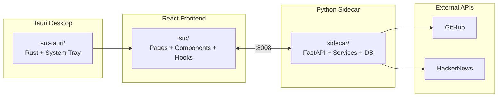

# CLAUDE.md

> Claude Code 在本專案中工作時的指引文件。
>
> **撰寫原則**：只記錄「從 code 看不出來的事」——路徑陷阱、跨層約定、函式庫的反直覺行為、設計取捨的理由。可以用一行指令查到的東西（有哪些服務、有哪些表、有幾個路由）**不寫進文件**，因為 `ls` 的答案永遠正確，而文件會過時。

**這個 repo 有四份文件，各有分工**：

| 文件 | 讀者 | 內容 |
|---|---|---|
| `README.md` | 對外 | 專案介紹、安裝、API 端點表 |
| **本檔** | Claude Code | 路徑陷阱、跨層約定、設計取捨 |
| **`docs/engineering.md`** | 貢獻者 | **工程規約——改動前必讀**：polling 必須 visibility-aware（`useSmartInterval`）、`ApiError` 四級降級、429 廣播 `starscope:rate-limited`、background task 的 shutdown 順序、E2E 一律 `data-testid`、coverage 門檻 80%、bundle 400KB gzipped |
| `CONTRIBUTING.md` | 對外 | commit 規範、PR 流程 |

⚠️ `docs/engineering.md` 的規約**不在本檔重複**，動到 polling／錯誤處理／背景任務前先讀它。

---

## 專案概述

StarScope 是一款桌面應用程式，透過速度分析（而非 star 絕對數量）幫助工程師理解 GitHub 專案的發展動能。使用 Tauri v2（Rust + React + Python sidecar）建構。

應用分兩層：**發現層**（Discovery 頁的 For You feed——依使用者興趣清單每日產生個人化推薦）與**監測層**（Watchlist、Trends、Compare、警報——對已追蹤 repo 做時序快照與訊號分析）。監測層的所有功能都依賴發現層或使用者手動把 repo 加入 watchlist，watchlist 為空時整個監測層不會有資料。


```mermaid
graph LR
    subgraph Desktop["Tauri Desktop"]
        T["src-tauri/\nRust + System Tray"]
    end

    subgraph Frontend["React Frontend"]
        F["src/\nPages + Components + Hooks"]
    end

    subgraph Backend["Python Sidecar"]
        B["sidecar/\nFastAPI + Services + DB"]
    end

    subgraph APIs["External APIs"]
        G["GitHub"]
        H["HackerNews"]
    end

    T --> F
    F <-->|":8008"| B
    B --> G
    B --> H
```

---

## 常用指令

### 前端

```bash
npm run dev              # Vite 開發伺服器（僅前端）
npm run tauri dev        # 完整 Tauri 應用程式
npm run build            # 建構前端
npm run type-check       # TypeScript 型別檢查
npm run lint             # ESLint 檢查
npm run lint:fix         # ESLint 自動修復
npm run format           # Prettier 格式化
npm run build:analyze    # Bundle 大小分析
```

### Python Sidecar

⚠️ **一律走 `sidecar/.venv/`，不要用裸 `python` / `pytest` / `alembic`。**
macOS 內建的 `python3` 是 3.9，而 `constants.py` 與 `db/models.py` 用了 `StrEnum`
（Python 3.11+，共 11 個類別的基底），裸執行會直接 `ImportError: cannot import name 'StrEnum'`。
CI 是綠的，因為 `actions/setup-python` 裝 3.12——**別把 CI 的指令原樣抄到本機**。

```bash
cd sidecar
.venv/bin/python main.py                           # 啟動 FastAPI :8008
.venv/bin/python -m pytest tests/ -v               # 執行所有測試
.venv/bin/python -m pytest tests/test_repos.py -v  # 單一測試檔
.venv/bin/python -m pytest tests/ --cov=.          # 覆蓋率
.venv/bin/alembic upgrade head                     # 資料庫遷移
.venv/bin/ruff check --fix .                       # Python lint（CONTRIBUTING 要求，易漏）
```

venv 不存在時：`cd sidecar && python3 -m venv .venv && .venv/bin/pip install -r requirements.txt`

### 單元測試（Vitest）

```bash
npx vitest run            # 跑一次就退出 ← 要「跑完拿結果」用這個
npm run test              # ⚠️ 等同 `vitest`，是 watch 模式，不會退出
npm run test:ui           # Vitest UI 模式
npm run test:coverage     # 覆蓋率報告
```

### E2E 測試

```bash
npm run test:e2e          # Playwright 全部測試
npm run test:e2e:chromium # 僅 Chromium
npm run test:e2e:ui       # 互動式 UI 模式
npm run test:e2e:headed   # 顯示瀏覽器視窗
```

### 完整開發流程

```bash
./start-dev.sh                  # 建議：檢查 venv、清掉佔用 8008 的殘留 process、
                                # trap 訊號時一併關掉 sidecar
```

手動兩個終端機的話要自己記得清 port（上次沒關乾淨會直接撞埠）：

```bash
lsof -ti:8008 | xargs kill -9   # 先清殘留
cd sidecar && .venv/bin/python main.py   # 終端機 1
npm run tauri dev                        # 終端機 2
```

---

## 專案結構

目錄結構用 `ls` 就看得到（README 有完整樹狀圖），這裡只記從名字看不出來的：

- `sidecar/routers/dependencies.py` **不是端點模組**，是 `Depends()` 的共用注入 helper
  ——數路由模組時要扣掉它
- `src-tauri/src/main.rs` 只是進入點，實作全在 `lib.rs`（sidecar 管理、系統匣、視窗控制）
- 前端測試散在各目錄的 `__tests__/`，不是集中一處

---

## 關鍵前端 Hooks

| Hook                     | 說明                                            |
|--------------------------|-----------------------------------------------|
| `useOSNotification`      | OS 層級通知（Tauri notification plugin）— 權限管理、發送通知 |
| `useNotifications`       | 通知中心整合 — 儲存、輪詢、操作、OS 通知整合                     |
| `useNotificationPolling` | 通知輪詢 — 定時取得已觸發警報，偵測新通知並發送 OS 推播               |
| `useImport`              | 批次匯入 — CSV/JSON/TXT 檔案解析、文字貼上                 |
| `useImportExecutor`      | 匯入執行器 — 循序調用 addRepo API、進度追蹤                 |
| `useAlertRules`          | 警報規則管理 — CRUD 操作、手動檢查、表單狀態                    |
| `useFeed`                | For You feed — 當日推薦、空清單自動產生一次、⭐/🚫 回饋           |
| `useInterests`           | 興趣清單與黑名單 CRUD（驅動 feed 的排序來源）                   |

---

## 環境設定

⚠️ **repo 裡有兩份 `.env.example`，用途不同**：

- `sidecar/.env.example` → Python 端（`GITHUB_CLIENT_ID` / `GITHUB_TOKEN` / `PORT` 等）
- 根目錄的 `.env.example` → Vite 端（`VITE_API_URL`）

內容直接 `cat` 該檔，這裡不複製一份免得漂移。不設 token 也能跑，只是 GitHub 配額降到 60/hr。

---

## 測試策略

| 類型     | 工具             | 位置                           |
|--------|----------------|------------------------------|
| 單元測試   | Vitest         | `src/**/__tests__/`          |
| 後端測試   | pytest（非同步）    | `sidecar/tests/`             |
| E2E 測試 | Playwright     | `e2e/`                       |
| CI     | GitHub Actions | `.github/workflows/test.yml` |

### 注意事項

- 重構 hooks 時需同步更新測試 mocks（例：`useWatchlist` → `useWatchlistState` + `useWatchlistActions`）
- 測試單一檔案 - `npx vitest run path/to/file.test.tsx`
- Context Provider 包裹順序 - `WatchlistProvider` 在 `I18nContext` 和 `ThemeContext` 內部
- ⚠️ **jsdom 不處理 CSS**：`toHaveClass("negative")` 對「有對應規則」與「規則根本不存在」
  完全無法區分，顏色／版面類的回歸測試只守得到 class 名那一層。要驗實際外觀得在瀏覽器
  量 `getComputedStyle()`
- ⚠️ **新增會寫入共用資源的 E2E spec，要加進 `playwright.config.ts` 的 `DB_MUTATING_SPECS`**
  ——那組 spec 只在 chromium 串行跑、用專屬 port 8009/1421 與獨立 DB，
  `reuseExistingServer: false` 是刻意的：否則會接管你正在跑的真實 sidecar，
  把當天 feed 提前消耗掉，而 `seen_repos` 是永久的（推薦過的 repo 不會再出現）

---

## 安全性決策記錄

### CSP `style-src 'unsafe-inline'`

`tauri.conf.json` 中的 CSP 使用 `style-src 'self' 'unsafe-inline'`。此決策的原因：

- **必要性**：Recharts 在 runtime 注入 inline styles，無法避免
- **風險評估**：`unsafe-inline` 僅適用於 `style-src`，`script-src` 並未包含 `unsafe-inline`（這是更關鍵的安全邊界）
- **Desktop 應用環境**：Tauri 應用不暴露於公共網路，XSS 攻擊面遠小於 Web 應用
- **結論**：可接受的 tradeoff。若未來 Recharts 支援 nonce-based CSP，應升級

### API 不使用版本化路徑

桌面應用的前端與後端一起打包發佈（同一個 Tauri binary），版本始終一致，因此 API 不需要 `/api/v1/` 版本前綴。

---

## 後端約定與陷阱

### 資料庫實際位置（最常踩的坑）

SQLite **不在 repo 目錄裡**。路徑由 `db/database.py` 的 `get_app_data_dir()` 決定，優先序：

1. `STARSCOPE_DATA_DIR` 環境變數（測試或自訂路徑）
2. `TAURI_APP_DATA_DIR`（正式環境由 Tauri 注入）
3. `~/.starscope`（開發環境回退）

除錯找資料庫時別在 `sidecar/` 底下找。遷移工具為 Alembic（`sidecar/alembic.ini`）。

### API 回應格式

所有端點回傳統一的 `ApiResponse[T]`：`{success, data, message, error}`。前端 `client.ts` 的 `doFetch` **會自動 unwrap `data` 欄位**，所以前端拿到的是 `data` 的內容而非整個信封——新增端點時若忘了包 `success_response()`，前端會拿到 undefined。

### 服務間依賴

查法：`grep -rn "from services\." sidecar/services/`

⚠️ **頂層 grep 抓不全**——`scheduler.py` 與 `github.py` 有函式內延遲 import 用來迴避循環依賴，
不掃函式體會漏掉。

真正需要記的是扇出規模：`scheduler.py` 是排程樞紐，牽動 **9 個** service
（alerts / anomaly_detector / backup / context_fetcher / feed_generator / github /
release_fetcher / settings / snapshot）。改 alerts 或 anomaly_detector 都會碰到它。

---

## 註解與日誌慣例

### 註解

- 一律繁體中文，技術術語保留英文；用語統一「回應」不用「響應」
- 只寫程式碼本身看不出來的約束或原因（why），不重述下一行在做什麼，不寫變更史（「原本」「新增」「取代」「簡化後」句式禁用——改寫成現在式的約束句）
- 檔案頭一律 `/** */`（TS）／`"""docstring"""`（Python）描述模組職責；公開函式配一行說明（與 Python docstring 全覆蓋的立場一致），行內註解只留 why
- **豁免區**（維持原樣，勿翻譯或改寫）：`sidecar/alembic/`（模板產物）、Rust `SAFETY:` 區塊（生態慣例用英文）、`src/test/` 測試基建

### 日誌

- Python：`[模組名] 繁中訊息`，同一模組固定同一個 prefix；middleware 的 `[request_id]` 動態 prefix 是刻意的請求追蹤格式
- 前端：一律走 `utils/logger`（生產環境 no-op），訊息帶 `[元件名]` prefix；唯一例外是 `main.tsx` 的全域 error handler（裸 console，理由見該處註解）
- Rust：不加 bracket prefix（tracing target 已提供模組上下文）

---

## 前端架構模式

### React Query 資料層

- **QueryClient 設定**（`lib/react-query.ts`）— staleTime 5min、gcTime 30min、retry 1
- **queryKeys 工廠** — 型別安全的 query key 生成器，避免魔術字串
- **寫入操作統一由 `WatchlistContext` actions 處理**（addRepo / removeRepo / fetchRepo / refreshAll / recalculateAll），成功後自動 invalidate cache——不要在元件裡直接呼叫 mutation
- **測試工具** — `createTestQueryClient()` 提供零快取零重試的測試用 QueryClient

### For You Feed 資料層

- `useFeed()` 回傳 `{ items, feedDate, isLoading, isGenerating, isError, stats, feedback }`
  - `stats` 尚未載到時是 `null`，**不要用 0 佔位**——那會被讀成「真的是 0 次」
  - **自動產生機制**：當日 feed 為空時自動觸發一次 `generateFeed`，用 `autoGenerated` ref 確保每次 mount 至多一次。產生後仍為空（例如興趣清單未設定）不會重試，避免無限迴圈
  - **刻意沒有手動重試按鈕**：feed 一天一批，有內容時後端冪等、無興趣時 `generate_feed` 直接 `return 0`，按了都不會有變化；真正需要重試的「產生失敗」情境，離開頁面再回來就會重新掛載並自動重試
  - `isError` 必須同時涵蓋查詢與產生失敗——generate 掛掉時 query 仍會成功回傳空清單，只看查詢會把 API 失敗誤報成「還沒設定興趣」
- `useInterests()` 的 `create`/`remove` 使用 `mutateAsync` 回傳 Promise，讓呼叫端能依實際結果決定 toast（避免失敗仍顯示成功）
- ⚠️ **`@tanstack/query-core` 5.95.2 的 `mutationFn` 會收到 `(variables, context)` 兩個參數**——直接把單參數的 client 函式當 `mutationFn` 傳入會多收 context。務必包成箭頭函式：`(id) => deleteInterest(id)`

### Watchlist Context + useReducer

- 資料層由 React Query 管理，Context 只負責 UI 狀態
- `LoadingState` 使用 Discriminated Unions 消除不可能狀態
- Context 分層（優化 re-render）：`WatchlistStateContext`（只讀狀態）／ `WatchlistActionsContext`（業務邏輯）
- Selector hooks 精準訂閱：`useSortedFilteredRepos()`、`useLoadingRepo()`、`useIsRefreshing()`、`useIsRecalculating()`
- 測試策略 — Mock Context hooks：`useWatchlistState`、`useWatchlistActions`

### React-Window 虛擬滾動（v2 API，陷阱多）

- **v2 使用 `rowComponent` prop，不是 v1 的 `children` render prop**（版本查 `package.json`，別寫死在這裡）
- `List` 的必填 props 是 `rowComponent`、`rowCount`、`rowHeight`、**`rowProps`**
  ——`style` 是**選填**（型別定義裡有 `?`）。實務上 `style` 要給高度才捲得動，
  但漏掉 `rowProps` 才是唯一會讓 `tsc` 紅字的那個
- ⚠️ `rowComponent` **必須是模組層級的穩定引用**，資料一律走 `rowProps`。
  v2 內部是 `useMemo(() => memo(rowComponent), [rowComponent])`——在元件內定義 row component
  會讓每次 render 整張表重掛
- 動態行高：`rowHeight` 支援 `(index: number) => number`，收合／展開兩種高度定義在 `pages/watchlist/RepoList.tsx`（`COLLAPSED_ITEM_SIZE` / `EXPANDED_ITEM_SIZE`）——**卡片改版時務必同步調整，行高寫死在 JS、CSS 改了不會自動反映**
- 圖表展開狀態由 `RepoList` 層級的 `expandedCharts: Set<number>` 管理
- **避免**：直接傳 `itemData` 到 `List`（改用 `rowProps`）；在 `RowComponent` 中用 inline arrow 當 memoized 子元件的 callback（會破壞 `RepoCard` 的 `memo`）——`onChartToggle` 因此設計成接受 `(repoId: number)` 參數
