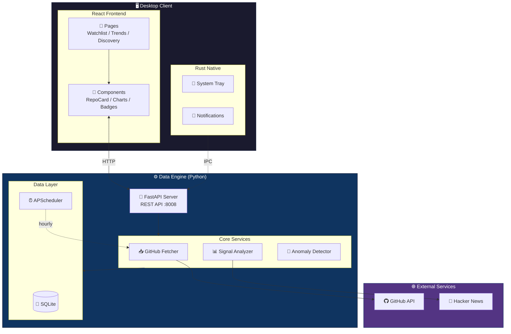

# StarScope

**GitHub Project Intelligence for Engineers**

[](https://opensource.org/licenses/MIT)
[](https://github.com/Neal75418/StarScope/actions/workflows/test.yml)
[](https://github.com/Neal75418/StarScope/actions/workflows/release.yml)

StarScope 是一個開源的**桌面工具**，幫工程師用「動能」而非「絕對數字」來觀察 GitHub 專案趨勢。

> "Don't just count stars. Catch rising stars early."

---

## 功能特色

### 核心功能

- **Watchlist** — 追蹤你關心的 GitHub 專案
- **Velocity 分析** — 計算 Star 成長速度（stars/day）
- **趨勢偵測** — 7 天/30 天變化趨勢
- **警報規則** — 設定條件觸發桌面通知

### 進階功能

- **Context Signal** — 告訴你「為什麼」專案爆紅
  - Hacker News 熱門討論偵測

- **智慧功能**
  - 相似專案推薦
  - 早期訊號偵測（Rising Star）

- **資料匯出**
  - JSON 格式匯出 Watchlist

- **多語言支援** — 英文/繁體中文雙語介面
  - 語言切換即時生效
  - 主題切換（淺色/深色）

---

## 技術架構



| 層級   | 技術                   |
|------|----------------------|
| 桌面框架 | Tauri v2             |
| 前端   | React + TypeScript   |
| 後端核心 | Python 3.12+ FastAPI |
| 本地儲存 | SQLite + SQLAlchemy  |

---

## 安裝與使用

### 前置需求

- Node.js 18+
- Rust (Tauri 需要)
- Python 3.12+

### 快速開始

```bash
# Clone 專案
git clone https://github.com/Neal75418/StarScope.git
cd StarScope

# 安裝前端依賴
npm install

# 安裝 Python 依賴
cd sidecar
pip install -r requirements.txt
cd ..
```

### 開發模式

```bash
# 終端機 1：啟動 Python sidecar
cd sidecar
python main.py

# 終端機 2：啟動 Tauri 開發模式
npm run tauri dev
```

### 建置桌面應用

```bash
npm run tauri build
```

### 驗證 API

```bash
curl http://127.0.0.1:8008/api/health
curl http://127.0.0.1:8008/api/repos
```

---

## 專案結構

```
StarScope/
├── src/                    # React 前端
│   ├── api/                # API 客戶端
│   ├── components/         # UI 元件
│   │   ├── RepoCard.tsx
│   │   ├── ContextBadges.tsx
│   │   ├── StarsChart.tsx
│   │   └── ...
│   ├── pages/              # 頁面
│   │   ├── Watchlist.tsx
│   │   ├── Trends.tsx
│   │   ├── Discovery.tsx
│   │   └── Settings.tsx
│   └── App.tsx
│
├── src-tauri/              # Tauri (Rust)
│   ├── src/main.rs
│   └── tauri.conf.json
│
└── sidecar/                # Python 資料引擎
    ├── main.py             # FastAPI 入口
    ├── requirements.txt
    ├── db/
    │   ├── database.py     # SQLite 連接
    │   └── models.py       # ORM 模型
    ├── routers/
    │   ├── repos.py        # Watchlist API
    │   ├── categories.py   # 分類 API
    │   ├── early_signals.py
    │   └── export.py       # 匯出 API
    └── services/
        ├── analyzer.py     # 訊號計算
        ├── context_fetcher.py
        ├── anomaly_detector.py
        └── recommender.py  # 相似專案推薦
```

---

## API 端點

### Watchlist

| 端點                      | 方法     | 說明              |
|-------------------------|--------|-----------------|
| `/api/repos`            | GET    | 取得所有追蹤的專案       |
| `/api/repos`            | POST   | 新增專案到 Watchlist |
| `/api/repos/{id}`       | DELETE | 移除專案            |
| `/api/repos/{id}/fetch` | POST   | 更新專案資料          |

### 分類與推薦

| 端點                                  | 方法  | 說明     |
|-------------------------------------|-----|--------|
| `/api/categories`                   | GET | 取得分類列表 |
| `/api/recommendations/similar/{id}` | GET | 取得相似專案 |

### 早期訊號

| 端點                           | 方法   | 說明      |
|------------------------------|------|---------|
| `/api/early-signals`         | GET  | 早期訊號列表  |
| `/api/early-signals/trigger` | POST | 觸發異常偵測  |

### 匯出

| 端點                           | 方法  | 說明                  |
|------------------------------|-----|---------------------|
| `/api/export/watchlist.json` | GET | 匯出 Watchlist (JSON) |

---

## 開發狀態

**功能完整** — 專注於核心價值的精簡設計

| 模組        | 狀態                           |
|-----------|------------------------------|
| 核心追蹤      | Watchlist、Velocity 分析、趨勢偵測   |
| 訊號系統      | HN 整合、警報規則                   |
| 智慧功能      | 相似推薦、早期訊號偵測                  |
| 匯出        | JSON 格式匯出                    |
| 國際化       | 英/繁中雙語、深淺主題                  |
| GitHub 整合 | OAuth Device Flow、Rate Limit |

> 測試覆蓋：331 frontend tests + backend tests

---

## 競品差異

| 產品              | 定位    | StarScope 差異   |
|-----------------|-------|----------------|
| GitHub Trending | 今日熱門  | 我們看「動能」不是「絕對值」 |
| Star History    | 歷史曲線  | 我們主動推送訊號       |
| OSS Insight     | 資料儀表板 | 我們是桌面原生 + 通知   |
| LibHunt         | 分類索引  | 我們專注追蹤與警報      |

**核心價值**：StarScope 是工程師的「專案雷達」，不是「專案目錄」。

---

## 貢獻指南

歡迎貢獻！請參閱 [CONTRIBUTING.md](CONTRIBUTING.md) 了解詳情。

1. Fork 這個專案
2. 建立你的功能分支 (`git checkout -b feature/AmazingFeature`)
3. 提交你的修改 (`git commit -m 'Add some AmazingFeature'`)
4. 推送到分支 (`git push origin feature/AmazingFeature`)
5. 開啟一個 Pull Request

---

## 授權

本專案採用 MIT 授權 - 詳見 [LICENSE](LICENSE) 檔案。

---

## 致謝

- [Tauri](https://tauri.app/) - 桌面應用框架
- [FastAPI](https://fastapi.tiangolo.com/) - Python Web 框架
- [Recharts](https://recharts.org/) - React 圖表庫
- [SQLAlchemy](https://www.sqlalchemy.org/) - Python ORM

---

Made with ❤️ by engineers, for engineers.
