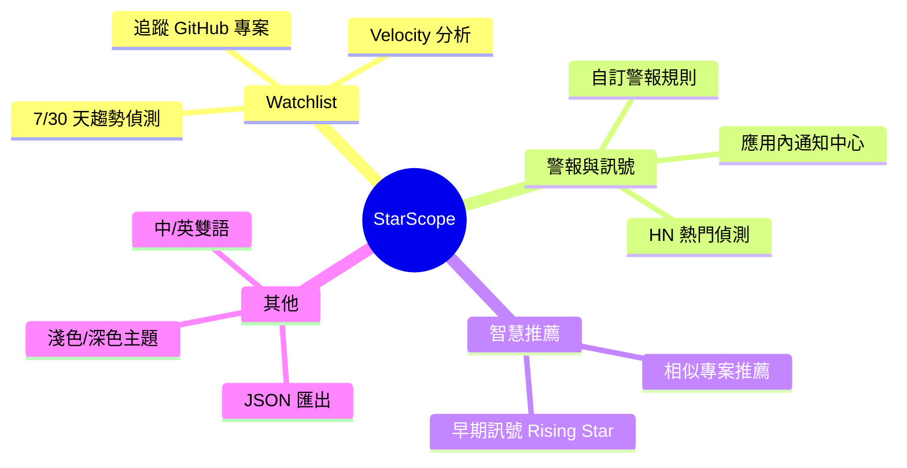
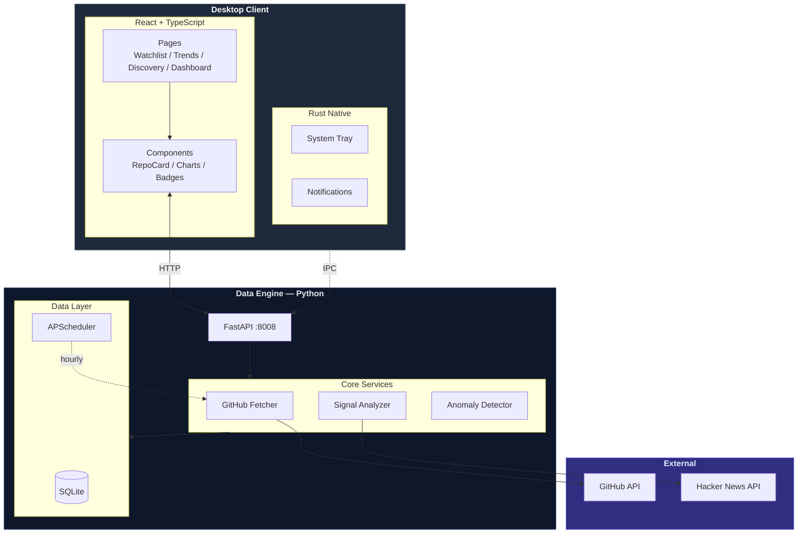

# StarScope

> **GitHub Project Intelligence for Engineers**
>
> _Don't just count stars — catch rising stars early._

[](https://opensource.org/licenses/MIT)
[](https://github.com/Neal75418/StarScope/actions/workflows/test.yml)
[](https://github.com/Neal75418/StarScope/actions/workflows/release.yml)

StarScope 是一款開源桌面工具，幫助工程師以**動能**而非絕對數字觀察 GitHub 專案趨勢。

---

## 功能一覽



---

## 技術架構



| 層級   | 技術                    |
|------|-----------------------|
| 桌面框架 | Tauri v2              |
| 前端   | React + TypeScript    |
| 後端   | Python 3.12 + FastAPI |
| 儲存   | SQLite + SQLAlchemy   |

---

## 快速開始

### 前置需求

- **Node.js** 18+
- **Rust** (Tauri 需要)
- **Python** 3.12+

### 安裝

```bash
git clone https://github.com/Neal75418/StarScope.git
cd StarScope

npm install                                        # 前端依賴
cd sidecar && pip install -r requirements.txt      # Python 依賴
```

### 開發模式

```bash
# 終端機 1 — Python sidecar
cd sidecar && python main.py

# 終端機 2 — Tauri 開發模式
npm run tauri dev
```

### 建置

```bash
npm run tauri build
```

---

## 專案結構

```
StarScope/
├── src/                        # React 前端
│   ├── api/                    #   API 客戶端
│   ├── components/             #   UI 元件
│   ├── hooks/                  #   Custom Hooks
│   ├── pages/                  #   頁面
│   │   ├── Watchlist.tsx
│   │   ├── Trends.tsx
│   │   ├── Discovery.tsx
│   │   ├── Dashboard.tsx
│   │   └── Settings.tsx
│   └── utils/                  #   工具函式
│
├── src-tauri/                  # Tauri (Rust)
│   ├── src/main.rs
│   └── tauri.conf.json
│
└── sidecar/                    # Python 資料引擎
    ├── main.py                 #   FastAPI 入口
    ├── db/                     #   SQLite + ORM
    ├── routers/                #   API 路由
    └── services/               #   業務邏輯
```

---

## API 端點

所有端點使用統一 `ApiResponse[T]` 格式回傳。共 15 個路由模組、64 個端點：

| 路由模組              | 前綴                     | 說明                        |
|---------------------|------------------------|---------------------------|
| `repos`             | `/api`                 | Repo CRUD、手動 fetch        |
| `alerts`            | `/api/alerts`          | 警報規則 CRUD、觸發記錄           |
| `trends`            | `/api/trends`          | 趨勢排行（velocity / delta）    |
| `categories`        | `/api/categories`      | 分類管理、repo 歸類             |
| `early_signals`     | `/api/early-signals`   | 早期信號、異常偵測                |
| `context`           | `/api/context`         | HN 情境信號與徽章               |
| `charts`            | `/api/charts`          | Star 歷史圖表資料              |
| `recommendations`   | `/api/recommendations` | 相似 repo 推薦               |
| `discovery`         | `/api/discovery`       | GitHub 搜尋                 |
| `commit_activity`   | `/api/commit-activity` | Commit 活動與摘要             |
| `languages`         | `/api/languages`       | 程式語言分佈                   |
| `star_history`      | `/api/star-history`    | Star 歷史回填                |
| `export`            | `/api/export`          | JSON/CSV 匯出              |
| `github_auth`       | `/api/github-auth`     | OAuth Device Flow         |
| `health`            | `/api`                 | 健康檢查                     |

---

## 開發狀態

**功能完整** — 專注核心價值的精簡設計

| 模組        | 涵蓋範圍                         |
|-----------|------------------------------|
| 核心追蹤      | Watchlist、Velocity 分析、趨勢偵測   |
| 訊號系統      | HN 整合、警報規則                   |
| 智慧功能      | 相似推薦、早期訊號偵測                  |
| 匯出        | JSON/CSV 格式                   |
| 國際化       | 英/繁中雙語、深淺主題                  |
| GitHub 整合 | OAuth Device Flow、Rate Limit |

> **測試覆蓋**：前端 665 + 後端 373 = 1038 個測試案例（86%+ 分支覆蓋率）

---

## 競品比較

| 產品              | 定位    | StarScope 差異  |
|-----------------|-------|---------------|
| GitHub Trending | 今日熱門  | 觀察「動能」而非「絕對值」 |
| Star History    | 歷史曲線  | 主動警報訊號        |
| OSS Insight     | 資料儀表板 | 桌面原生 + 應用內通知  |
| LibHunt         | 分類索引  | 專注追蹤與警報       |

> **核心定位**：StarScope 是工程師的「專案雷達」，不是「專案目錄」。

---

## 貢獻

歡迎貢獻！詳見 [CONTRIBUTING.md](CONTRIBUTING.md)。

```bash
git checkout -b feature/your-feature    # 建立分支
git commit -m "feat: ..."              # 提交修改
git push origin feature/your-feature    # 推送
# 開啟 Pull Request
```

---

## 授權

本專案採用 [MIT License](LICENSE)。

---

## 致謝

[Tauri](https://tauri.app/) |
[FastAPI](https://fastapi.tiangolo.com/) |
[Recharts](https://recharts.org/) |
[SQLAlchemy](https://www.sqlalchemy.org/)

---

Made with ❤️ by engineers, for engineers.
