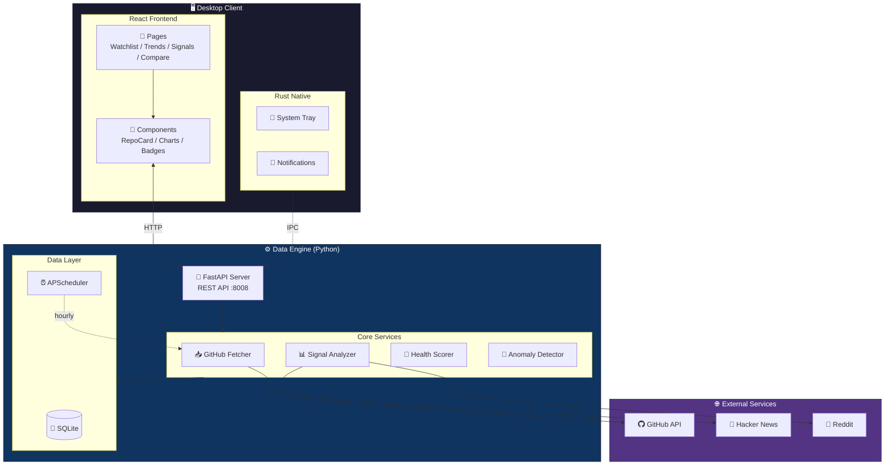

# StarScope

**GitHub Project Intelligence for Engineers**

[](https://opensource.org/licenses/MIT)
[](https://github.com/Neal75418/StarScope/actions/workflows/test.yml)
[](https://github.com/Neal75418/StarScope/actions/workflows/release.yml)

StarScope 是一個開源的**桌面工具**，幫工程師用「動能」而非「絕對數字」來觀察 GitHub 專案趨勢。

> "Don't just count stars. Understand momentum."

## 📝 專案評價

想了解 StarScope 的架構設計與代碼品質？請參考：**[PROJECT_REVIEW.md](./PROJECT_REVIEW.md)**

> ⭐⭐⭐⭐⭐ **100/100** (滿分)
> *架構清晰、代碼品質高、112 項測試全數通過、文檔專業*

---

## 功能特色

### 核心功能

- **Watchlist** — 追蹤你關心的 GitHub 專案
- **Velocity 分析** — 計算 Star 成長速度（stars/day）
- **趨勢偵測** — 7 天/30 天變化趨勢
- **警報規則** — 設定條件觸發桌面通知

### 進階功能

- **Context Signal** — 告訴你「為什麼」專案爆紅
  - Hacker News 熱門討論偵測
  - Reddit 社群熱度追蹤
  - GitHub Releases 發布追蹤

- **健康度評分** — 綜合 7 維度評估專案健康度
  - Issue 回應時間
  - PR 合併率
  - Release 頻率
  - Bus Factor（核心貢獻者數量）

- **智慧功能**
  - 自動標籤分類
  - 相似專案推薦
  - 早期訊號偵測（Rising Star）
  - 生態系比較（如 Bun vs Deno）

- **輸出與整合**
  - CSV/JSON 資料匯出
  - Webhook 整合（Slack/Discord）
  - 週報摘要產生

- **多語言支援** — 英文/繁體中文雙語介面
  - 語言切換即時生效
  - 主題切換（淺色/深色）

---

## 技術架構



| 層級   | 技術                   |
|------|----------------------|
| 桌面框架 | Tauri v2             |
| 前端   | React + TypeScript   |
| 後端核心 | Python 3.12+ FastAPI |
| 本地儲存 | SQLite + SQLAlchemy  |

---

## 安裝與使用

### 前置需求

- Node.js 18+
- Rust (Tauri 需要)
- Python 3.12+

### 快速開始

```bash
# Clone 專案
git clone https://github.com/Neal75418/StarScope.git
cd StarScope

# 安裝前端依賴
npm install

# 安裝 Python 依賴
cd sidecar
pip install -r requirements.txt
cd ..
```

### 開發模式

```bash
# 終端機 1：啟動 Python sidecar
cd sidecar
python main.py

# 終端機 2：啟動 Tauri 開發模式
npm run tauri dev
```

### 建置桌面應用

```bash
npm run tauri build
```

### 驗證 API

```bash
curl http://127.0.0.1:8008/api/health
curl http://127.0.0.1:8008/api/repos
```

---

## 專案結構

```
StarScope/
├── src/                    # React 前端
│   ├── api/                # API 客戶端
│   ├── components/         # UI 元件
│   │   ├── RepoCard.tsx
│   │   ├── HealthBadge.tsx
│   │   ├── ContextBadges.tsx
│   │   ├── StarsChart.tsx
│   │   └── ...
│   ├── pages/              # 頁面
│   │   ├── Watchlist.tsx
│   │   ├── Compare.tsx
│   │   ├── Signals.tsx
│   │   └── Settings.tsx
│   └── App.tsx
│
├── src-tauri/              # Tauri (Rust)
│   ├── src/main.rs
│   └── tauri.conf.json
│
└── sidecar/                # Python 資料引擎
    ├── main.py             # FastAPI 入口
    ├── requirements.txt
    ├── db/
    │   ├── database.py     # SQLite 連接
    │   └── models.py       # ORM 模型
    ├── routers/
    │   ├── repos.py        # Watchlist API
    │   ├── categories.py   # 分類 API
    │   ├── comparisons.py  # 比較 API
    │   ├── early_signals.py
    │   ├── export.py       # 匯出 API
    │   └── webhooks.py     # Webhook API
    └── services/
        ├── analyzer.py     # 訊號計算
        ├── health_scorer.py
        ├── context_fetcher.py
        ├── anomaly_detector.py
        ├── webhook.py
        └── digest.py
```

---

## API 端點

### Watchlist

| 端點                      | 方法     | 說明              |
|-------------------------|--------|-----------------|
| `/api/repos`            | GET    | 取得所有追蹤的專案       |
| `/api/repos`            | POST   | 新增專案到 Watchlist |
| `/api/repos/{id}`       | DELETE | 移除專案            |
| `/api/repos/{id}/fetch` | POST   | 更新專案資料          |

### 分類與標籤

| 端點                                  | 方法  | 說明     |
|-------------------------------------|-----|--------|
| `/api/categories`                   | GET | 取得分類列表 |
| `/api/tags`                         | GET | 取得標籤列表 |
| `/api/recommendations/similar/{id}` | GET | 取得相似專案 |

### 比較與訊號

| 端點                           | 方法       | 說明     |
|------------------------------|----------|--------|
| `/api/comparisons`           | GET/POST | 比較群組管理 |
| `/api/early-signals`         | GET      | 早期訊號列表 |
| `/api/early-signals/trigger` | POST     | 觸發異常偵測 |

### 匯出與 Webhook

| 端點                      | 方法       | 說明                      |
|-------------------------|----------|-------------------------|
| `/api/export/watchlist` | GET      | 匯出 Watchlist (JSON/CSV) |
| `/api/export/signals`   | GET      | 匯出訊號資料                  |
| `/api/digest/{period}`  | GET      | 產生週報/日報                 |
| `/api/webhooks`         | GET/POST | Webhook 管理              |

---

## 開發進度

### Phase 1 — MVP ✅

- [x] GitHub Watchlist（新增/刪除/列表）
- [x] Star delta / velocity 計算
- [x] SQLite 本地儲存
- [x] React 基本 UI
- [x] Tauri 桌面視窗

### Phase 2 — 排程 + 通知 ✅

- [x] 自動排程更新（每小時/每天）
- [x] Tauri 系統通知
- [x] 系統托盤常駐
- [x] Alerts 規則引擎
- [x] 趨勢排行視圖

### Phase 3 — Context Signal ✅

- [x] Hacker News API 整合
- [x] Reddit API 整合
- [x] GitHub Releases 追蹤
- [x] 「為什麼爆紅」上下文顯示
- [x] 歷史趨勢圖表

### Phase 4 — 專案健康度 ✅

- [x] Issue 回應時間分析
- [x] PR 合併率計算
- [x] 貢獻者分布（Bus Factor）
- [x] Release 節奏分析
- [x] 綜合健康度評分（7 維度）

### Phase 5 — 智慧功能 ✅

- [x] 自動標籤（by 技術棧/用途）
- [x] 自訂分類（資料夾結構）
- [x] 生態系對決比較視圖
- [x] 相似專案推薦
- [x] 早期訊號偵測（Rising Star, Sudden Spike, Breakout）

### Phase 6 — 輸出與整合 ✅

- [x] CSV/JSON 資料匯出
- [x] Webhook 整合（Slack/Discord/Generic）
- [x] 週報/日報摘要產生
- [x] 完整桌面打包（DMG/EXE/AppImage）

### Phase 7 — 國際化 ✅

- [x] i18n 基礎架構 (React Context + TypeScript)
- [x] 英文 (EN) / 繁體中文 (zh-TW) 雙語支援
- [x] 所有 UI 元件國際化 (120+ 處)
- [x] 主題切換 (Light/Dark Mode)

### Phase 8 — GitHub 整合 ✅

- [x] GitHub OAuth Device Flow 認證
- [x] API Rate Limit 顯示
- [x] 連接狀態管理 (連接/斷開)

---

## 競品差異

| 產品              | 定位    | StarScope 差異   |
|-----------------|-------|----------------|
| GitHub Trending | 今日熱門  | 我們看「動能」不是「絕對值」 |
| Star History    | 歷史曲線  | 我們主動推送訊號       |
| OSS Insight     | 資料儀表板 | 我們是桌面原生 + 通知   |
| LibHunt         | 分類索引  | 我們專注追蹤與警報      |

**核心價值**：StarScope 是工程師的「專案雷達」，不是「專案目錄」。

---

## 貢獻指南

歡迎貢獻！請參閱 [CONTRIBUTING.md](CONTRIBUTING.md) 了解詳情。

1. Fork 這個專案
2. 建立你的功能分支 (`git checkout -b feature/AmazingFeature`)
3. 提交你的修改 (`git commit -m 'Add some AmazingFeature'`)
4. 推送到分支 (`git push origin feature/AmazingFeature`)
5. 開啟一個 Pull Request

---

## 授權

本專案採用 MIT 授權 - 詳見 [LICENSE](LICENSE) 檔案。

---

## 致謝

- [Tauri](https://tauri.app/) - 桌面應用框架
- [FastAPI](https://fastapi.tiangolo.com/) - Python Web 框架
- [Recharts](https://recharts.org/) - React 圖表庫
- [SQLAlchemy](https://www.sqlalchemy.org/) - Python ORM

---

Made with ❤️ by engineers, for engineers.
