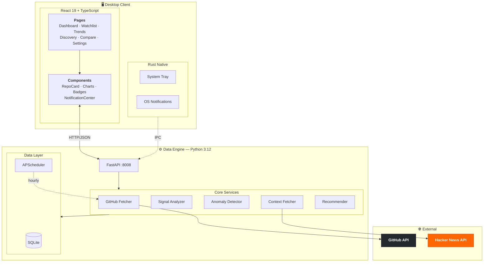

<div align="center">

# ⭐ StarScope

**GitHub Project Intelligence for Engineers**

_Don't just count stars — catch rising stars early._


</div>

---

StarScope 是一款開源桌面應用，幫助工程師以**動能（velocity）**而非絕對數字追蹤 GitHub 專案趨勢。
透過 star 加速度分析、異常偵測與 Hacker News 情境整合，讓你在眾人之前發現 Rising Star。

**為什麼選擇 StarScope？**

- 📡 **動能追蹤** — 觀察速度與加速度，而非靜態 star 數字
- 🔔 **主動通知** — 自訂警報規則 + OS 層級推播通知
- 🧠 **智慧推薦** — 基於 topics 與語言的相似專案推薦
- 📊 **儀表板總覽** — 一眼掌握所有追蹤專案的關鍵指標

> **核心定位**：StarScope 是工程師的「專案雷達」，不是「專案目錄」。

## 🗺️ 功能一覽


```mermaid
graph TB
    Root(("⭐<br/><b>StarScope</b>"))

    Root --- Track["📡 追蹤與分析"]
    Root --- Alert["🔔 警報與通知"]
    Root --- Smart["🧠 智慧功能"]
    Root --- Data["📦 資料管理"]
    Root --- UX["✨ 使用者體驗"]

    Track --- T1["Watchlist 追蹤"]
    Track --- T2["Velocity / Acceleration"]
    Track --- T3["7/30/90 天趨勢"]
    Track --- T4["Star 歷史回填"]
    Track --- T5["語言分佈"]

    Alert --- A1["自訂警報規則"]
    Alert --- A2["應用內通知中心"]
    Alert --- A3["OS 層級推播通知"]
    Alert --- A4["Hacker News 熱門偵測"]

    Smart --- S1["相似專案推薦"]
    Smart --- S2["早期訊號偵測"]
    Smart --- S3["異常偵測 Sudden Spike"]
    Smart --- S4["Dashboard 儀表板"]

    Data --- D1["批次匯入 CSV/JSON/TXT"]
    Data --- D2["JSON / CSV 匯出"]
    Data --- D3["樹狀分類管理"]
    Data --- D4["GitHub OAuth 認證"]

    UX --- U1["中／英雙語"]
    UX --- U2["淺色／深色主題"]
    UX --- U3["虛擬滾動"]
    UX --- U4["頁面過場動畫"]

    classDef root fill:#fbbf24,stroke:#b45309,color:#1f2937,font-weight:bold,font-size:16px
    classDef track fill:#3b82f6,stroke:#1d4ed8,color:#fff,font-weight:bold
    classDef alert fill:#ef4444,stroke:#b91c1c,color:#fff,font-weight:bold
    classDef smart fill:#8b5cf6,stroke:#6d28d9,color:#fff,font-weight:bold
    classDef data fill:#10b981,stroke:#047857,color:#fff,font-weight:bold
    classDef ux fill:#f59e0b,stroke:#d97706,color:#fff,font-weight:bold

    class Root root
    class Track,T1,T2,T3,T4,T5 track
    class Alert,A1,A2,A3,A4 alert
    class Smart,S1,S2,S3,S4 smart
    class Data,D1,D2,D3,D4 data
    class UX,U1,U2,U3,U4 ux
```

> **測試覆蓋**：前端 1,199 + 後端 471 = **1,670 個測試案例**，E2E 11 specs / 44 tests

## 🏗️ 技術架構


```mermaid
graph TB
    subgraph Desktop["🖥️ Desktop Client"]
        direction TB
        subgraph UI["React 19 + TypeScript"]
            Pages["<b>Pages</b><br/>Dashboard · Watchlist · Trends<br/>Discovery · Compare · Settings"]
            Components["<b>Components</b><br/>RepoCard · Charts · Badges<br/>NotificationCenter"]
        end
        subgraph Native["Rust Native"]
            Tray["System Tray"]
            Notify["OS Notifications"]
        end
        Pages --> Components
    end

    subgraph Engine["⚙️ Data Engine — Python 3.12"]
        direction TB
        API["FastAPI :8008"]
        subgraph Services["Core Services"]
            Fetch["GitHub Fetcher"]
            Analyze["Signal Analyzer"]
            Detect["Anomaly Detector"]
            Context["Context Fetcher"]
            Recommend["Recommender"]
        end
        subgraph Data["Data Layer"]
            DB[("SQLite")]
            Sched["APScheduler"]
        end
        API --> Services
        Services --> Data
        Sched -.->|hourly| Fetch
    end

    subgraph Ext["🌐 External"]
        GH["GitHub API"]
        HN["Hacker News API"]
    end

    Components <-->|HTTP/JSON| API
    Native -.->|IPC| API
    Fetch --> GH
    Context --> HN

    classDef github fill:#24292e,stroke:#0d1117,color:#fff,font-weight:bold
    classDef hackernews fill:#ff6600,stroke:#c2410c,color:#fff,font-weight:bold
    class GH github
    class HN hackernews
```

> 其他關鍵依賴：React Query v5（server state）· react-window v2（虛擬滾動）· SQLAlchemy（ORM）· CSS @keyframes（動畫）

## 🚀 快速開始

### 前置需求

| 工具      | 版本            |
|---------|---------------|
| Node.js | 20+ (LTS)     |
| Rust    | latest stable |
| Python  | 3.12+         |

### 安裝

```bash
git clone https://github.com/Neal75418/StarScope.git
cd StarScope

# 前端依賴
npm install

# Python 依賴
cd sidecar && pip install -r requirements.txt && cd ..

# 環境設定（選用，提升 GitHub API 配額）
cp sidecar/.env.example sidecar/.env
# 編輯 sidecar/.env 填入 GITHUB_CLIENT_ID 或 GITHUB_TOKEN
```

### 開發模式

```bash
# 終端機 1 — Python sidecar
cd sidecar && python main.py

# 終端機 2 — Tauri 開發模式
npm run tauri dev
```

### 建置與測試

```bash
npm run tauri build              # 建置桌面應用

npm run test                     # 前端單元測試
cd sidecar && pytest tests/ -v   # 後端測試
npm run test:e2e                 # E2E 測試
```

## 📂 專案結構

```
StarScope/
├── src/                           # React 前端（TypeScript）
│   ├── api/                       #   API 客戶端 + 自動生成型別
│   ├── components/                #   UI 元件
│   │   ├── motion/                #     CSS 動畫元件（FadeIn、AnimatedPage）
│   │   ├── settings/              #     設定頁面元件
│   │   └── ...
│   ├── constants/                 #   API、訊號類型、語言色彩
│   ├── contexts/                  #   WatchlistContext + Reducer
│   ├── hooks/                     #   54 個 Custom Hooks
│   │   └── selectors/             #     Watchlist selector hooks
│   ├── i18n/                      #   英／繁中翻譯
│   ├── lib/                       #   React Query 設定
│   ├── pages/                     #   6 個頁面
│   │   ├── Dashboard.tsx          #     儀表板總覽
│   │   ├── Watchlist.tsx          #     追蹤清單（虛擬滾動）
│   │   ├── Trends.tsx             #     趨勢排行
│   │   ├── Discovery.tsx          #     探索 GitHub
│   │   ├── Compare.tsx            #     多專案對比
│   │   └── Settings.tsx           #     設定與警報管理
│   ├── theme/                     #   淺色／深色主題
│   ├── types/                     #   共用 TypeScript 型別
│   └── utils/                     #   工具函式（13 個模組）
│
├── src-tauri/                     # Tauri 桌面層（Rust）
│   ├── src/
│   │   ├── main.rs                #   進入點
│   │   └── lib.rs                 #   Sidecar、Tray、Notification
│   ├── capabilities/              #   安全權限設定
│   └── tauri.conf.json            #   視窗、CSP、Bundle 設定
│
├── sidecar/                       # Python 資料引擎
│   ├── main.py                    #   FastAPI 入口（port 8008）
│   ├── routers/                   #   16 個路由模組
│   ├── services/                  #   15 個業務邏輯服務
│   ├── schemas/                   #   Pydantic 資料模型
│   ├── db/                        #   SQLite + SQLAlchemy（11 張表）
│   ├── middleware/                #   日誌 + 限速中介層
│   ├── alembic/                   #   資料庫遷移
│   └── tests/                     #   pytest 後端測試（471 個）
│
├── e2e/                           # Playwright E2E 測試
└── .github/workflows/             # CI/CD（test + release）
```

## 🔌 API 端點

所有端點使用統一 `ApiResponse[T]` 格式回傳 `{success, data, message, error}`：

| 路由模組              | 前綴                     | 說明                                    |
|-------------------|------------------------|---------------------------------------|
| `repos`           | `/api`                 | Repo CRUD、手動 fetch、批次刷新               |
| `alerts`          | `/api/alerts`          | 警報規則 CRUD、觸發記錄、確認                     |
| `trends`          | `/api/trends`          | 趨勢排行（velocity / delta / acceleration） |
| `categories`      | `/api/categories`      | 分類管理、tree 結構、repo 歸類                  |
| `early_signals`   | `/api/early-signals`   | 早期信號、異常偵測、批次確認                        |
| `context`         | `/api/context`         | HN 情境信號與徽章                            |
| `charts`          | `/api/charts`          | Star 歷史圖表資料（7d/30d/90d）               |
| `recommendations` | `/api/recommendations` | 相似 repo 推薦、相似度計算                      |
| `discovery`       | `/api/discovery`       | GitHub 搜尋（限速 30/min）                  |
| `star_history`    | `/api/star-history`    | Star 歷史回填（< 5000 stars）               |
| `comparison`      | `/api/comparison`      | 多專案對比圖表資料                             |
| `weekly_summary`  | `/api/summary`         | 每週摘要報告                                |
| `export`          | `/api/export`          | Watchlist JSON / CSV 匯出               |
| `github_auth`     | `/api/github-auth`     | OAuth Device Flow、連線狀態                |
| `app_settings`    | `/api/settings`        | 排程間隔、快照保留、偵測門檻等設定管理                   |
| `health`          | `/api`                 | 健康檢查                                  |

> 📖 完整 API 文件可在開發模式下存取：`http://localhost:8008/api/docs`（Swagger）/ `http://localhost:8008/api/redoc`（ReDoc）

---

## 🤝 貢獻

歡迎貢獻！詳見 [CONTRIBUTING.md](CONTRIBUTING.md)。

```bash
git checkout -b feature/your-feature    # 建立分支
git commit -m "feat: ..."              # 提交修改（Conventional Commits）
git push origin feature/your-feature    # 推送並開啟 PR
```

## 📄 授權

本專案採用 [MIT License](LICENSE)。

## 🙏 致謝

[Tauri](https://tauri.app/) ·
[React](https://react.dev/) ·
[FastAPI](https://fastapi.tiangolo.com/) ·
[React Query](https://tanstack.com/query) ·
[Recharts](https://recharts.org/) ·
[SQLAlchemy](https://www.sqlalchemy.org/) ·
[react-window](https://github.com/bvaughn/react-window)

---

<div align="center">

[](https://opensource.org/licenses/MIT)
[](https://github.com/Neal75418/StarScope/actions/workflows/test.yml)
[](https://github.com/Neal75418/StarScope/actions/workflows/release.yml)

Made with ❤️ by engineers, for engineers.

</div>
