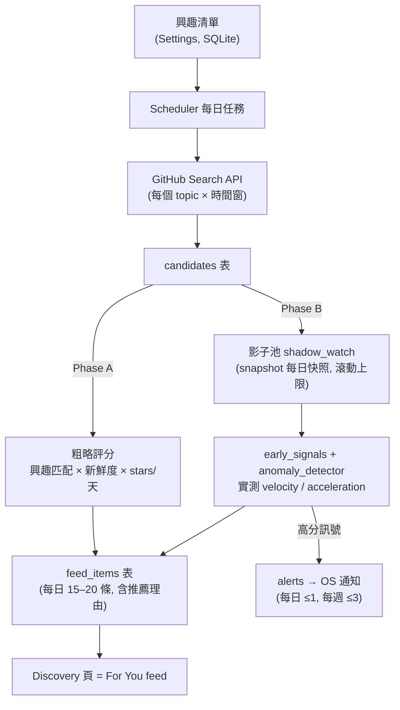
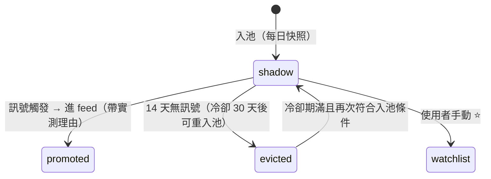

# For You Feed — 個人化每日發現 Feed 設計

日期：2026-08-01
狀態：設計定案，待實作計畫

## 背景與問題

StarScope v1.0.0 feature complete 後未進入作者的日常使用。診斷結論：

1. **形態錯配**：「發現新專案」是低頻 push 型需求，卻做成需要主動打開的桌面 app。
2. **訊號偏移**：原始目標是「找到有用的專案」，實作卻收斂到「star 動能追蹤」——量測的是 hype，不是與使用者的相關性。
3. **缺回饋迴路**：作者不是日常使用者，功能演化沒有被真實使用拉動。

現有管道（GitHub Trending、HN、newsletter）的共同盲點是**不認識使用者**：全球熱門榜對個人的訊噪比太低。本設計把產品重新對準唯一的差異化空間：**只有結合使用者興趣與自建時序資料才算得出來的排序**。

## 目標與成功判準

- 目標：使用者每天願意主動打開 app，看到 15–20 個「跟自己有關、有潛力、看了有感」的專案。
- **Phase A 閘門（寫死，不憑感覺）**：Phase A 上線後連續使用 7 天，若打開 ≥ 4 天 → 投入 Phase B；否則停損，結論為「題目不成立」，不以加功能救場。
- 通知精確度優先於召回：寧可漏報，不可誤報到讓使用者關閉通知。

## 非目標

- 不做通用搜尋引擎（不自建全網爬蟲與索引，候選來源仍為 GitHub Search API）。
- 不做多使用者/雲端服務；單機單人。
- Phase A 不做「從回饋自動調整興趣權重」——單人資料量下噪音大於訊號，興趣清單由使用者手動維護。
- 不重塑整個 app：Watchlist / Trends / Compare / Dashboard 頁面不動。

## 整體架構



關鍵決定：

- **candidates 與 shadow_watch 分開**：前者是「搜到過的」（大、只有 metadata、便宜），後者是「值得花 API 配額追蹤的」（小、有快照成本）。Phase A 只建 candidates，schema 不需日後重構。
- **feed_items 落地成表而非即時計算**：開啟秒出、當日內容穩定、推薦理由可回溯。每日 scheduler 產出一批，過期輪替。
- **全面重用現有元件**：scheduler、snapshot、early_signals、anomaly_detector、alerts、rate_limiter、RepoCard。新增僅：興趣清單 CRUD、候選抓取、評分器、feed UI。

## 資料模型

新增資料表（欄位為設計意圖，實作時依 Alembic 慣例補齊型別與索引）：

| 表 | 關鍵欄位 | 說明 |
|---|---|---|
| `interests` | `term`, `kind(topic/language/keyword)`, `weight(1–3)` | 使用者手動維護 |
| `exclude_terms` | `term` | 黑名單；初始建議：`awesome`, `interview`, `roadmap`, `tutorial` |
| `candidates` | `repo_id`, `full_name`, metadata, `first_seen_at`, `interest_match` | 搜尋結果暫存池 |
| `shadow_watch` | `repo_id`, `state(shadow/promoted/evicted)`, `enrolled_at`, `evicted_at` | Phase B 影子池 |
| `feed_items` | `repo_id`, `date`, `score`, `reason_json`, `feedback(null/starred/dismissed)` | 每日 feed 產出 |
| `seen` | `repo_id`, `last_shown_at`, `dismissed` | 防重複 |

## 排序設計（Phase A）

```
score = interest_match × freshness × momentum_lite

interest_match = Σ 命中興趣的 weight
                 topic 完全匹配 ×1.0；language ×0.6；name/description 含 keyword ×0.4
freshness      = 依 pushed_at 衰減：30 天內活躍 = 1.0，之後線性下降
momentum_lite  = log(1 + stars ÷ 專案存在天數)
```

- `momentum_lite` 取 log：抑制爆紅專案屠版——那類專案使用者反正會在別處看到，feed 空間留給中段潛力股。
- **防重複**：`seen` 表；推過不再推。例外：Phase B 偵測到新起飛訊號可帶新理由回鍋一次。
- **多樣性上限**：同一 topic 最多佔當日 feed 1/3。
- **回饋動作**：⭐ 加入 watchlist；🚫 不感興趣（永不回鍋）；滑過（無操作）。
- **推薦理由**：`reason_json` 存評分細節，渲染為一行人話（例：「topic: tauri 命中 · 45 天 +380 stars · 上週仍活躍」）。作用：建立對排序的信任 + 排序出錯時能一眼定位是哪個 term 太寬。

Phase B 上線後，`momentum_lite` 整項替換為影子池實測 acceleration 的池內百分位，公式其餘不動。

## 影子池生命週期（Phase B）

入池條件（全部滿足）：

- `interest_match` 超過門檻（只追蹤與使用者相關的）
- stars 低於上限（暫定 3,000，調參期修正）——已經紅的沒有早期發現價值
- 不在 `seen`、不在黑名單、不在冷卻期

狀態機：



- 池子滾動（淘汰→補新）即 feed 新鮮感的引擎；冷卻期防止溫吞專案反覆進出浪費配額。
- 訊號判定重用 `early_signals` 與 `anomaly_detector`，至少 3 個快照點才評分（入池後 2–3 天靜默期）。
- 評分用**池內百分位**而非絕對門檻——不同語言生態的 star 規模差異太大，百分位自動適應。

## 通知（Phase B）

通知是稀缺資源；唯一死法是太吵被關掉。

- 僅池內最強訊號觸發：**每日 ≤ 1 則、每週 ≤ 3 則**。
- 文案直接給結論（例：「someone/repo 三天加速度進入你的池內前 5%，Rust / 遊戲引擎」）。
- 點擊落在 feed 對應項，不是 app 首頁。

## 配額紀律

Phase B 第一個任務：掛上 rate_limiter 計數實跑一天，量出 search + 快照 + metadata 的真實消耗，再定影子池上限。**300 個是設計假設，不是承諾**；一切容量參數以實測為準。

## UI 改動範圍

- **Discovery 頁**：預設畫面改為 For You feed（當日 15–20 條）；原關鍵字搜尋保留於頂部搜尋列。
- **Feed 卡片**：重用 RepoCard，新增推薦理由行 + ⭐/🚫 回饋鈕。
- **Settings**：新增興趣清單管理（CRUD + 黑名單）。Phase B 加「從你的 star 建議興趣」按鈕——呼叫 GitHub API 統計使用者 starred repos 的 topics/語言頻率，產生建議清單，採納與否由使用者決定（建議不直接影響排序）。
- **首次體驗**：興趣清單為空時，feed 顯示引導畫面請使用者先填 3–5 個興趣；不做 onboarding 精靈。
- 其他頁面不動。

## 測試策略

- **評分器（純函數）窮舉單元測試**：三種 kind 的匹配權重、momentum 邊界（created 當天、zero stars）、freshness 衰減端點。門檻類邏輯窮舉，不抽樣。
- **影子池狀態機**（Phase B 重心）：每條狀態轉移各有測試，含負向案例（冷卻期內不得重新入池）。
- **Feed 生成管線 integration**：mock GitHub 回應，驗證去重、多樣性上限、seen 過濾。
- **E2E**（掛入現有 Playwright suite）：feed 渲染、⭐ 進 watchlist、🚫 永不回鍋。
- **不測**：GitHub API 自身行為；排序主觀好壞（由 7 天使用閘門負責）。

## 階段規劃

| 階段 | 內容 | 規模 |
|---|---|---|
| Phase A | interests/exclude/candidates/feed_items/seen + 粗略評分 + feed UI + Settings 興趣管理 | 約 1–2 週 |
| 閘門 | 連用 7 天，打開 ≥ 4 天才繼續 | 1 週 |
| Phase B | shadow_watch 狀態機 + 訊號評分接管排序 + OS 通知 + star 興趣建議 + 配額實測 | 約 3–4 週 |

## 風險

- **排序不準期**：Phase A 前幾天興趣清單需要手動迭代；推薦理由的可解釋性是主要除錯工具。
- **API 配額**：以實測為準；影子池上限可下修，feed 品質降級但不失效。
- **訊號雜訊**（Phase B）：百分位門檻需要調參期；通知上限保護使用者體驗不被調參期波及。
